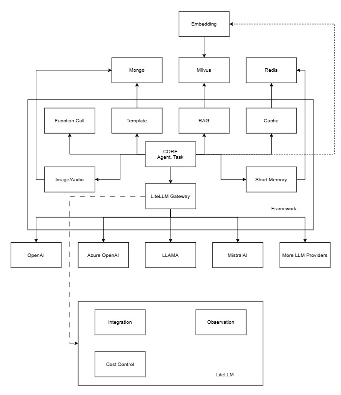
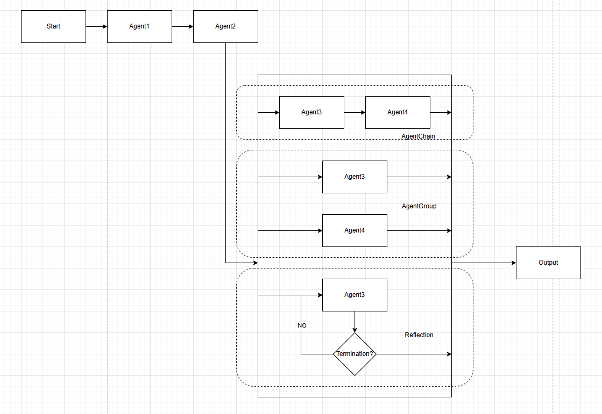
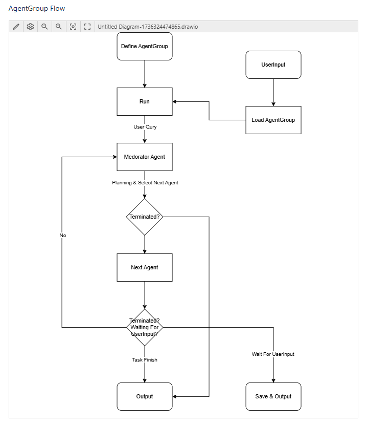

# Brief
A framework based on Core-NG.

# Architecture

## Agent
### Template
A customizable template that allows users to implement their own template engine.  
Built-in template engine - Mustache
> It operates by expanding tags in a template using values provided in a hash or object.   
> We refer to it as "logic-less" because there are no if statements, else clauses, or for loops. Instead, there are only tags.   
> Some tags are replaced with a value, some with nothing, and others with a series of values.  
> [mustache.java](https://github.com/spullara/mustache.java), [mustache](https://mustache.github.io/mustache.5.html)
### Variable (Context)
Users can pass variables to the agent and compile them into the prompt template.
### Memory
- Short-term memory is a built-in feature that allows agents to remember the last n messages.
- Long-term memory is feature for app to pass the memory like user's information/user's config to the agent. this is different from the RAG context, because the RAG context is load everytime through query's similarity.
### Persistence
- Persistence - domain to store the agent's data
- PersistenceProvider - provider that offer persistence capability
### Formatter
Users can create their own formatter if they want their agent to receive formatted output (also available in the agent context).  
For example: The `DefaultJsonFormatter` allows users to get a clean string that can be used with `JSON.fromJSON`
### Vision
An agent type that performs image QA. (Currently, only URL is supported, base64 image format may be supported in the future)
### Reflection
An agent type that performs n round completions to reflection, with the output being the final answer.  
For example: the `CotAgent` (Chain Of Thought)
#### Termination
Termination is used for Self-loop agents.  
A general Termination that users can implement their own termination method.  
Predefined termination methods include:
- `MaxRoundTermination`
- `MaxTokenTermination`
- `StopMessageTermination`
- `UserCancelledTermination`
### StatusEventListener
This feature can be used for database operations and more.
### MessageUpdatedEventListener
This feature can be used for message notifications or streaming the message to end-users, among other things.
## Pattern

### Chain
TBD
### Group

### Self-loop (Reflection)
TBD
## Default Agents
- ModeratorAgent - Agent that use in the agent group, planning the task solving process and control the agent flow.
- DefaultImageCaptionAgent - Agent that caption an image.
- DefaultImageGenerateAgent - Agent that generate an image.
- PromptOptimizeAgent - Agent that optimize the prompt.
## Tooling
### Function calling
TBD
## LLM
A general `LLMProvider` that allows developers to implement their own LLM integration
### LiteLLM proxy server
Provides LiteLLM as the built-in LLMProvider
> Call 100+ LLMs using the OpenAI Input/Output Format  
> [litellm](https://litellm.vercel.app/)  

To start a local demo LiteLLM proxy server, use the following command:
```bash  
docker run --rm -v $(pwd)/litellm_config.yaml:/app/config.yaml -e AZURE_API_KEY=your-api-key -e AZURE_API_BASE=your-azure-endpoint -p 4000:4000 ghcr.io/berriai/litellm:main-latest --config /app/config.yaml  
```  
litellm_config.yml
- gpt-4o model for chat and vision use
- text-embedding-ada-002 for embedding use
```yaml  
model_list:  
  - model_name: gpt-4o  
    litellm_params:  
      model: azure/gpt-4o  
      api_base: os.environ/AZURE_API_BASE  
      api_key: "os.environ/AZURE_API_KEY"  
  - model_name: text-embedding-ada-002  
    litellm_params:  
      model: azure/text-embedding-ada-002  
      api_base: os.environ/AZURE_API_BASE  
      api_key: "os.environ/AZURE_API_KEY"  
```  
## RAG
A general `VectorStore` that allows developers to implement their own VectorStore integration
### Milvus
> The High-Performance Vector Database Built for Scale  
> [milvus](https://milvus.io/)  

Provides Milvus as the built-in VectorStore  
Start a local demo single point Milvus server using the following yaml:
`docker-compose.exe up`
```yaml
version: '3.5'

services:
  etcd:
    container_name: milvus-etcd
    image: quay.io/coreos/etcd:v3.5.5
    environment:
      - ETCD_AUTO_COMPACTION_MODE=revision
      - ETCD_AUTO_COMPACTION_RETENTION=1000
      - ETCD_QUOTA_BACKEND_BYTES=4294967296
      - ETCD_SNAPSHOT_COUNT=50000
    volumes:
      - ${DOCKER_VOLUME_DIRECTORY:-.}/volumes/etcd:/etcd
    command: etcd -advertise-client-urls=http://127.0.0.1:2379 -listen-client-urls http://0.0.0.0:2379 --data-dir /etcd
    healthcheck:
      test: ["CMD", "etcdctl", "endpoint", "health"]
      interval: 30s
      timeout: 20s
      retries: 3

  minio:
    container_name: milvus-minio
    image: minio/minio:RELEASE.2023-03-20T20-16-18Z
    environment:
      MINIO_ACCESS_KEY: minioadmin
      MINIO_SECRET_KEY: minioadmin
    ports:
      - "9001:9001"
      - "9000:9000"
    volumes:
      - ${DOCKER_VOLUME_DIRECTORY:-.}/volumes/minio:/minio_data
    command: minio server /minio_data --console-address ":9001"
    healthcheck:
      test: ["CMD", "curl", "-f", "http://localhost:9000/minio/health/live"]
      interval: 30s
      timeout: 20s
      retries: 3

  standalone:
    container_name: milvus-standalone
    image: milvusdb/milvus:v2.4.15
    command: ["milvus", "run", "standalone"]
    security_opt:
      - seccomp:unconfined
    environment:
      ETCD_ENDPOINTS: etcd:2379
      MINIO_ADDRESS: minio:9000
    volumes:
      - ${DOCKER_VOLUME_DIRECTORY:-.}/volumes/milvus:/var/lib/milvus
    healthcheck:
      test: ["CMD", "curl", "-f", "http://localhost:9091/healthz"]
      interval: 30s
      start_period: 90s
      timeout: 20s
      retries: 3
    ports:
      - "19530:19530"
      - "9091:9091"
    depends_on:
      - "etcd"
      - "minio"

networks:
  default:
    name: milvus
```