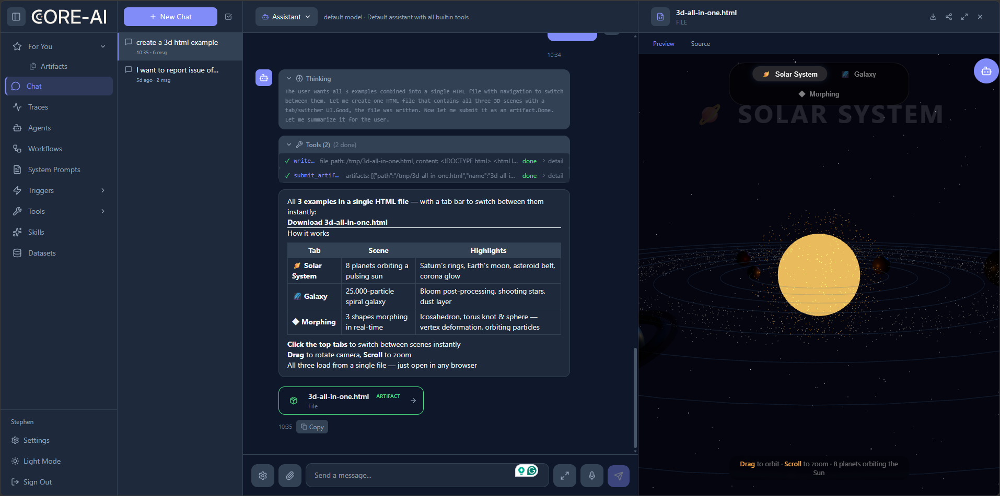
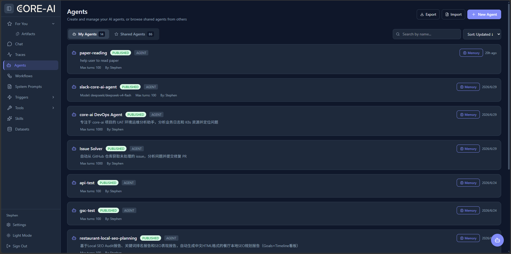
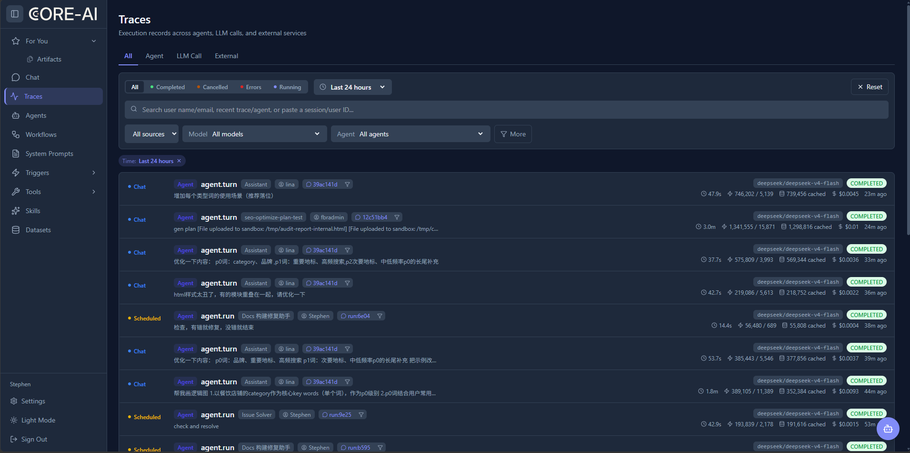
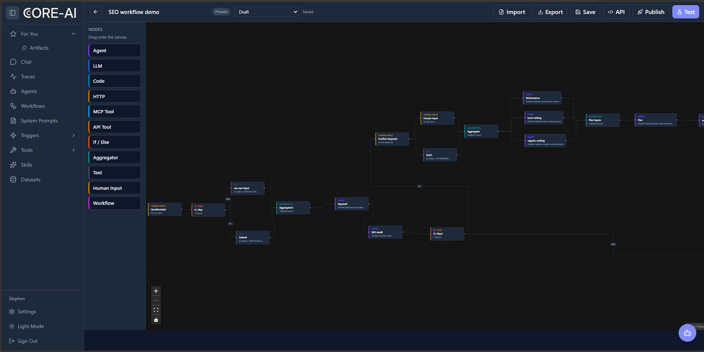
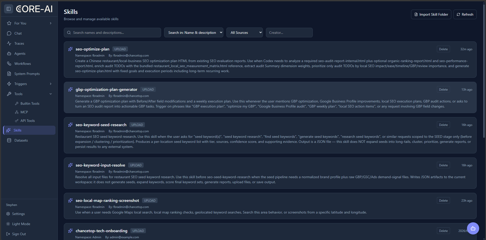
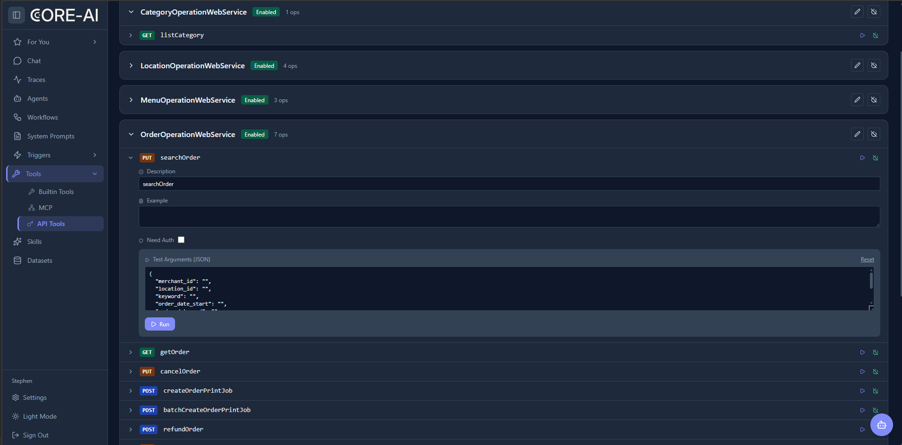
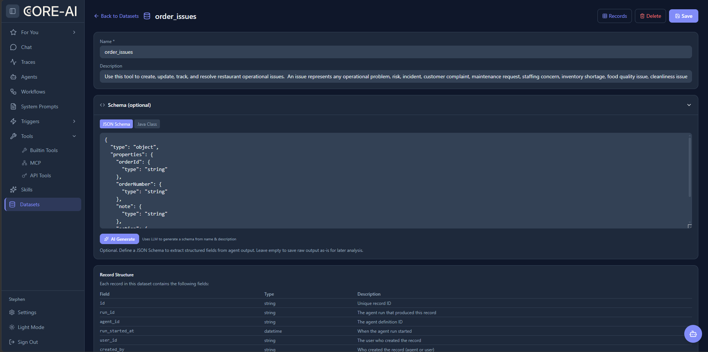
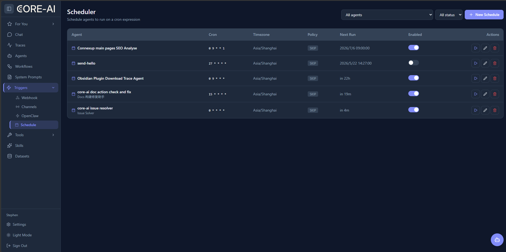

# Core-AI Server

Core-AI Server is the backend service for the Core-AI platform. It provides a web UI and REST APIs for AI agent management, interactive chat, visual workflow orchestration, observability tracing, skill management, cron scheduling, and multi-provider LLM routing.

---

## Chat — Interactive AI Agent

The chat interface connects you with AI agents through a real-time SSE stream. Agents can invoke tools, generate file artifacts, and render live previews — all inline within the conversation.



**Key capabilities:**

- **Streaming SSE** — text chunks, reasoning content, tool calls, and status changes arrive in real-time
- **Tool execution** — built-in tools (file operations, web search, code execution) plus custom MCP tools
- **Artifact generation** — agents produce downloadable files with inline preview (HTML, code, images)
- **Human-in-the-loop** — tool calls can require user approval before execution
- **Session management** — multi-turn conversations with persistent context, skill loading, and sub-agent delegation

---

## Agents — Define & Manage AI Agents

Create, configure, publish, and share AI agents. Each agent definition includes system prompt, model selection, tool permissions, skills, sub-agents, and execution parameters.



**Agent features:**

- **Draft / Published lifecycle** — edit drafts safely, publish immutable snapshots for production
- **Multi-model support** — OpenAI, Azure, DeepSeek, OpenRouter, LiteLLM, and any OpenAI-compatible API
- **Tool permissions** — assign built-in tools, MCP tools, and API tools per agent
- **Skills & sub-agents** — compose agents from modular skill packages and delegate to sub-agents
- **Shared agents** — explore and clone agents shared by your team
- **Import / Export** — move agent definitions between environments

---

## Traces — Full Observability

Inspect every agent execution with detailed trace records. Built-in OTLP ingestion with Langfuse-compatible endpoint — no external tracing service required.



**Observability features:**

- **Trace types** — filter by Agent, LLM Call, or External service
- **Status tracking** — Completed, Cancelled, Error, Running with real-time updates
- **Token & cost metrics** — input/output tokens, cached tokens, and dollar cost per trace
- **Duration tracking** — per-trace latency from seconds to minutes
- **Span tree** — drill into individual operations within a trace
- **Search & filter** — by user, session, agent, model, or paste a session/trace ID

---

## Workflows — Visual Orchestration

Build complex multi-step workflows with a drag-and-drop canvas editor. Combine agents, LLM calls, code execution, HTTP calls, tool invocations, conditionals, and human input nodes into automated pipelines.



**Workflow features:**

- **13 node types** — START, END, AGENT, LLM, CODE, HTTP, IF/ELSE, AGGREGATOR, TEMPLATE, MCP_TOOL, API_TOOL, HUMAN_INPUT, WORKFLOW
- **Branching & merging** — conditional logic with aggregator nodes to rejoin paths
- **Human input** — pause workflows for human approval, then resume
- **Version management** — save published versions, restore to draft, export/import as JSON
- **Test & publish** — test workflows inline, publish for production, expose as API
- **Run history** — track and replay workflow runs with per-node execution records

---

## Skills — Reusable Domain Knowledge

Skills provide modular, reusable domain knowledge packages that agents can load on demand. Each skill includes instructions, allowed tools, and resource files.



**Skill features:**

- **Import Skill Folder** — bulk-register skills from a directory
- **Search & filter** — by name, description, source, or creator
- **Namespace isolation** — organize skills by team or project
- **Git-sourced skills** — sync skills from git repositories with auto-refresh
- **Agent integration** — load/unload skills dynamically in chat sessions
- **Tool constraints** — restrict which tools a skill can use

---

## API Tools — Test & Manage External APIs

An interactive API explorer for testing web service endpoints. Register service APIs, browse operations, and execute calls with editable JSON payloads — all from the browser.



**API tools features:**

- **Service discovery** — auto-discover APIs from registered web services
- **Operation browser** — grouped by service, color-coded by HTTP verb
- **JSON test arguments** — editable payloads with reset-to-default
- **Auth toggle** — test endpoints with or without authentication
- **One-click execution** — run individual operations and inspect responses
- **MCP bridging** — expose API operations as MCP tools for agents to call

---

## Datasets — Structured Data Management

Define schemas, store structured records, and let agents read/write data through built-in tools. Each dataset has an optional JSON Schema for field validation and structured extraction.



**Dataset features:**

- **Schema editor** — JSON Schema or Java Class definition with code editor
- **AI Generate** — auto-generate schema from dataset name and description using LLM
- **Built-in fields** — every record tracks agent run, user, and creation metadata
- **Query API** — time-range, field projection, agent filter, and pagination
- **Agent tools** — insert, update, delete, and query dataset records from within agent runs

---

## Scheduler — Cron-Based Automation

Schedule agents to run automatically on cron expressions. Monitor next-run times, toggle schedules on/off, and manage concurrency policies.



**Scheduler features:**

- **Cron expressions** — standard 5-field cron with timezone support
- **Concurrency policies** — SKIP (skip if already running) or PARALLEL (allow concurrent)
- **Live next-run display** — shows absolute timestamps and relative countdowns
- **Manual trigger** — run a scheduled agent on demand
- **Enable / Disable** — toggle schedules without deleting
- **Edit & delete** — modify cron expressions, inputs, and variables inline

---

## Architecture

```
┌─────────────────────────────────────────────────┐
│                  Web UI (React)                  │
├─────────────────────────────────────────────────┤
│              REST API / SSE / OTLP               │
├─────────────────────────────────────────────────┤
│              Service Layer                       │
│  Agent · Session · Workflow · Trace · Schedule   │
│  Tool Registry · Skill · Dataset · Trigger       │
├─────────────────────────────────────────────────┤
│              Core-AI Library                     │
│  LLM Providers · MCP · Sandbox · Multi-Agent     │
├─────────────────────────────────────────────────┤
│              Infrastructure                      │
│  MongoDB · Redis · Object Storage · Kubernetes   │
└─────────────────────────────────────────────────┘
```

## API Overview

| Category | Endpoints |
|---|---|
| **Auth** | register, login, invite, user management |
| **Agent Definitions** | CRUD, publish, create from session, webhook |
| **Agent Runs** | trigger, list, get, cancel, direct LLM call |
| **Sessions** | create, send message, approve tools, history, SSE stream |
| **Schedules** | CRUD with cron expressions and concurrency policies |
| **Triggers** | webhook & schedule triggers with secret rotation |
| **Workflows** | CRUD, publish versions, execute, resume, node run history |
| **Tools** | list, categories, MCP server CRUD, enable/disable, test |
| **Skills** | register, list, sync, download |
| **Datasets** | CRUD, schema management, record query |
| **Files** | upload, download, share, delete |
| **Traces** | search, detail, span tree, prompt management |

## Quick Start

```bash
# Clone and start with Docker
git clone https://github.com/chancetop-com/core-ai.git
cd core-ai
docker compose -f docker-compose.local.yml up -d
```

Open [https://localhost:8443](https://localhost:8443). Default admin: `admin@example.com` / `admin`

> See the [full server README](../../core-ai-server/README.md) for detailed API reference, configuration options, and development setup.
