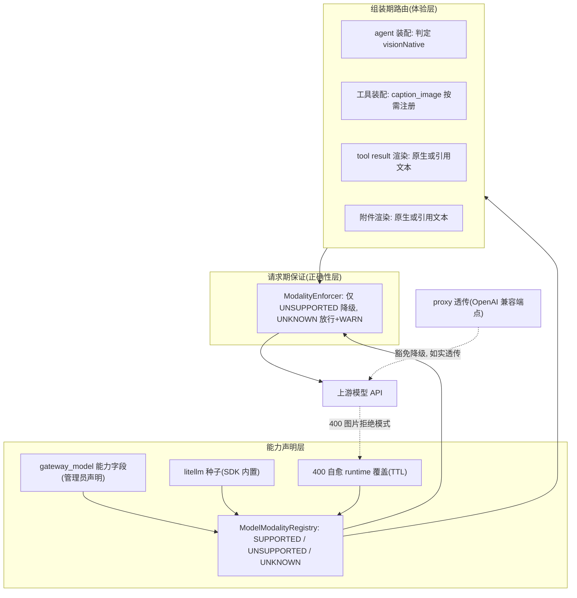

# 模型模态感知与图片处理路由设计

> 状态: Draft v2
> 日期: 2026-08-03
> 相关事故: dev 环境 `invalid sse response, statusCode=400, unknown variant image_url, expected text`
>
> v2 修订要点(相对 v1):
> 1. 能力判定从"集合 + 未知默认纯文本"改为**三值语义**——未知模型放行而非剥图,避免静默打断现有视觉链路(已验证反例:`azure/responses/gpt-5-mini` 无法被 litellm 种子解析);
> 2. 新增**模型名归一化**设计(4.5 节),这是能力查询实际可用性的前提;
> 3. proxy 透传流量**豁免**请求期降级,保持 OpenAI 兼容 API 的如实透传语义;
> 4. 400 自愈从 P3 可选提前为 **P1 必要件**(UNKNOWN 放行后的收敛闭环);
> 5. P0 范围修正(不再引用 P1 才存在的能力查询);SubAgentAssembler 修复升格为显式决策记录;
> 6. 补齐遗漏触点:Compression、sink 序列化前置 bug、`supports_file` 全同步面、CLI 装配。

## 1. 背景

### 1.1 事故回放

dev 环境一个长会话(38+ 条消息)中,历史里混入了一个 `image_url` 内容块(base64 data URI,约 740KB),
下一轮 LLM 请求把完整历史发给了 `deepseek/deepseek-v4-flash`(纯文本模型),DeepSeek 的 Rust 服务端拒绝反序列化,
返回 400,框架侧表现为 `CustomHTTPClientImpl` 抛出 `invalid sse response`,会话中断。

### 1.2 现状问题清单

| # | 问题 | 位置 |
|---|------|------|
| 1 | 工具返回 IMAGE 结果时,无条件以 base64 `image_url` 注入历史 | `AgentHelper.buildToolMessage` / `buildImageContent` |
| 2 | API 调用方传 base64 图片附件时,无条件以 `image_url` 注入历史 | `AgentHelper.buildImageAttachedContent` |
| 3 | chat 会话路径的 multiModalModel 兜底链断裂:`SubAgentAssembler` 配了主模型就跳过兜底,且不查 `SystemSettingsService`;server 侧无人调用 `LLMProviderConfig.setMultiModalModel`,provider 级兜底恒为 null | `SubAgentAssembler.configureMultiModalModel` / `toSessionConfig` |
| 4 | `CaptionImageTool.resolveModel` 兜底链最后两级会掉回纯文本主模型,同样触发 400 | `CaptionImageTool.resolveModel` |
| 5 | 发送前没有任何按模型能力的内容校验 | `LiteLLMProvider` / `GatewayLLMProvider` |
| 6 | `gateway_model` 已有 `supports_vision` / `supports_video` 字段,但只用于管理端展示,不参与任何路由决策 | `GatewayModelConfig` / `GatewayRoutingEngine` |
| 7 | 图片一旦进历史,`ModelGateway.resolveEffectiveModel` 扫全历史,会话永久钉在 multiModalModel 上(image-in-history 方案的固有代价,目前无缓解手段) | `ModelGateway` |
| 8 | 压缩摘要只取每条消息第一个内容块的文本(`getTextContent`),多部件消息的图片与后续文本块静默丢弃;`[image, text]` 顺序的消息直接返回 null | `Compression.formatMessages` / `Message.getTextContent` |

### 1.3 已具备的基础设施

- `gateway_model` 集合已有能力字段:`supports_vision`、`supports_video`、`supports_tools`、`supports_stream`,
  且已接入三个写入来源:上游发现(`GatewayModelDiscoveryService`)、管理端手工(`GatewayModelRequest`)、目录种子(`GatewayModelCatalog`)。
- core-ai 内置 litellm 模型库 `model_prices_and_context_window.json`(经 `LLMModelContextRegistry` 加载),
  含 965 条 `supports_vision` 记录;已验证事故模型 `deepseek/deepseek-v4-flash` 在种子中存在。
  当前仅解析了上下文窗口字段,能力字段未解析;名称查找逻辑只会给裸名加前缀,不会剥离前缀(见 4.5)。
- `GatewayLLMProvider` 是 server 上所有 LLM 请求的收口:agent 主循环、CaptionImageTool、proxy 透传均经过它;
  `GatewayRoutingEngine.modelConfig(modelId)` 已可按模型 ID 查到配置。
- 视频已经是"引用 + 专用工具"模式(`buildVideoReferenceHint` + `understand_video`),视频本体从不进历史,可作为图片改造的参照。

## 2. 目标与非目标

### 目标

1. **已知不支持**某模态的模型永远收不到该模态内容——事故类 400 从机制上消除;
2. **未知能力**的模型不被静默降级——现有正常工作的视觉链路不因本设计上线而悄悄失效;
3. 多模态模型保留原生看图能力,不被降级到 caption 中转;
4. 模型能力成为 Gateway 的一等配置,路由与工具装配按声明执行;
5. 图片/PDF/视频三类媒体的处理架构统一为:**能力允许则原生,否则引用 + 专用工具**。

目标 1 与 2 是一对张力:剥错(false-strip)静默破坏正常功能且永不自纠;放错(false-pass)产生一次 400 但可自愈收敛。
本设计选择**只在有确凿证据时才降级**(三值语义,见 4.2),用 400 自愈(6.4)兜住未知侧。

### 非目标

- 输出模态路由(图片生成、TTS 等)——已由 media provider 体系覆盖;
- 历史中原生图片的窗口化/滚动淘汰(缓解问题 #7 的成本面)——记为后续优化;
- 音频输入支持——枚举预留,不实现。

## 3. 总体设计:能力声明 + 双层执行

核心原则:**组装期路由是体验优化,请求期降级是正确性保证,两层缺一不可。**

- 只做组装期:会话中途切模型、旧会话续聊、存量数据,都会把不合法内容漏给上游 → 400 复发;
- 只做请求期:纯文本 agent 拿不到 caption_image 工具,图片虽不炸但也没人能看 → 功能缺失。



## 4. 能力模型

### 4.1 模态枚举

与 `Content.ContentType` 对齐(core-ai,`ai.core.llm` 包):

```java
public enum InputModality {
    TEXT,     // always supported
    IMAGE,    // maps to ContentType.IMAGE_URL
    FILE,     // maps to ContentType.FILE (PDF etc.)
    VIDEO,    // maps to ContentType.VIDEO
    AUDIO     // reserved, not implemented
}
```

### 4.2 三值判定语义(v2 核心修订)

能力查询的返回不是布尔,而是三值:

```java
public enum ModalitySupport {
    SUPPORTED,     // positive evidence: model accepts this modality
    UNSUPPORTED,   // positive evidence: model rejects this modality
    UNKNOWN        // no evidence either way
}
```

执行语义:

| 判定 | 请求期行为 | 理由 |
|------|-----------|------|
| UNSUPPORTED | 降级(替换为引用/占位文本) | 有确凿证据,降级是避免 400 的正确动作 |
| SUPPORTED | 放行 | 正常路径 |
| UNKNOWN | **放行** + WARN 日志 + trace 标记 | 剥错静默破坏功能且永不自纠;放错至多一次 400,由自愈(6.4)收敛为 UNSUPPORTED |

> v1 曾定为"未知默认纯文本(降级)",已否决。实证反例:dev 默认多模态模型 `azure/responses/gpt-5-mini`
> 无法被 litellm 种子解析(`responses/` 是自家路由约定,种子中无此 key),若按 v1 规则,
> 走静态 fallback provider 的请求会把发给它的图片剥掉——指定的多模态模型自己被当成纯文本,且完全静默。

### 4.3 统一查询接口(SDK 侧)

core-ai 框架不能依赖 server 的 Mongo,能力查询定义为接口,server 注入实现:

```java
public interface ModelModalityRegistry {
    // Never returns null; UNKNOWN when no evidence is available.
    ModalitySupport supports(String model, InputModality modality);
}
```

### 4.4 数据源与判定规则

按优先级逐层查询,先命中先返回:

| 优先级 | 数据源 | 判定规则 |
|--------|--------|----------|
| 1 | 400 自愈 runtime 覆盖(TTL 缓存,见 6.4) | 命中即 UNSUPPORTED |
| 2 | `gateway_model` 能力字段(server 实现) | `true` → SUPPORTED;`false` → UNSUPPORTED;`null` → 落到下一层 |
| 3 | litellm 种子(SDK 默认实现,扩展 `LLMModelContextRegistry`) | 条目存在且 `supports_vision=true` → SUPPORTED;**条目存在但字段缺失** → UNSUPPORTED(litellm 惯例:仅支持时写 true);条目不存在 → UNKNOWN |
| 4 | 兜底 | UNKNOWN(TEXT 恒为 SUPPORTED) |

验证过的关键用例(P1 验收标准):

- `deepseek/deepseek-v4-flash`:种子命中、无 `supports_vision` → IMAGE=UNSUPPORTED → **事故被机制性拦截**;
- `azure/responses/gpt-5-mini`:种子 miss → UNKNOWN → 放行,视觉功能不受影响;
  若注册进 gateway_model 并声明 `supports_vision=true` → SUPPORTED(推荐做法)。

### 4.5 模型名归一化(v2 新增)

系统中并存三套命名,能力查询的可用性完全取决于归一化质量:

| 命名体系 | 示例 | 说明 |
|----------|------|------|
| gateway modelId | `gpt-5-mini` | 平台内标识,`gateway_model.model_id` |
| litellm 名 | `deepseek/deepseek-v4-flash`、`azure/gpt-5-mini` | 上游/种子的 key |
| 路由约定名 | `azure/responses/gpt-5-mini` | `responses/` 段是自家 Responses bridge 标记,litellm 中不存在 |

归一化规则(实现于查询层,调用方无感知):

1. **server 实现**:先按原名精确匹配 `gateway_model.model_id`;命中后如需种子回填,用该模型的 `upstream_model` 字段查种子(它才是 litellm 名);
2. **SDK 种子实现**,依次尝试:原名精确匹配 → 剥离路由约定段(`responses/`)后匹配 → 剥离已知 provider 前缀(`azure/`、`openai/`、`anthropic/`、`bedrock/`、`deepseek/`、`gemini/`、`vertex_ai/`)后匹配 → 现有的加前缀/去日期后缀逻辑;
3. 全部 miss → UNKNOWN(而非猜测)。

现状缺口:`LLMModelContextRegistry.getModelInfo` 只会给裸名**加**前缀,从不剥离,`deepseek/` 也不在前缀表中——归一化扩展是 P1 的实际工程量所在,已列入改动清单。

### 4.6 gateway_model 字段演进

沿用现有布尔字段风格,不迁移为数组(零迁移成本,且 null 语义在三值判定中有明确含义):

- 已有:`supports_vision`、`supports_video`;
- 新增:`supports_file`(nullable,Mongo 无 schema,无需 migration);
- 同步面(v1 遗漏,全列):`GatewayModelConfig`、`GatewayModelRequest`、`GatewayModelView`、`GatewayModelMetadata`、
  `GatewayModelCatalog`、`GatewayModelDiscoveryService` 映射、前端模型管理表单;
- 代码层对外暴露三值语义,布尔与 null 的映射见 4.4。

`GatewayModelDiscoveryService` 已解析上游 `supports_vision`/`vision` 字段;P3 补充:发现结果为空时用 litellm 种子按 `upstream_model` 回填,减少人工打标。

## 5. 组装期路由(体验层)

### 5.1 visionNative 判定与 hybrid 模式

agent 装配时(`SubAgentAssembler` / `AgentRunBuilder` / workflow `AgentExecutor`)计算:

```
mainVision   = supports(model, IMAGE) != UNSUPPORTED
hybridVision = multiModalModel != null && supports(multiModalModel, IMAGE) != UNSUPPORTED
visionNative = mainVision || hybridVision
```

注意 UNKNOWN 在装配期按"可用"处理(与请求期放行一致),避免未打标模型的工具集被错误裁剪。

**hybrid 模式(纯文本主模型 + multiModalModel 兜底)的归宿是一个显式权衡**,v1 未讨论,此处列明:

| 选项 | 行为 | 代价 |
|------|------|------|
| (a) 归入原生路径(默认,维持现状语义) | 图片原生进历史,`ModelGateway` 切换到 multiModalModel | 一张图进历史后,会话所有后续轮次永久钉在 multiModalModel 上(问题 #7),成本上升 |
| (b) 归入 caption 路径 | 图片以引用进历史,会话始终留在便宜的主模型 | 视觉保真度下降;multiModalModel 配置形同虚设 |

默认取 (a) 以保持行为兼容;提供 agent 级配置 `preferCaptionPath`(默认 false)允许选 (b),
成本敏感的 agent 可显式切换。该配置同时覆盖原"强制 caption 省成本"诉求。

### 5.2 工具装配:caption_image 按需注册

- `visionNative == true`:默认**不注册** `caption_image`——模型自己能看图,冗余工具只会被误用;
- `visionNative == false` 或 `preferCaptionPath == true`:注册 `caption_image`(及 `summarize_pdf`);
- 不写死"多模态必不注册":当前的显式保留手段是 `preferCaptionPath`(强制 caption 路径即保留工具);
  另外 400 自愈把模型标记为 text-only 后,裁剪逻辑感知 runtime override,caption_image 会在 TTL 内重新出现,
  避免降级占位文本指向一个模型调不到的工具;
- **CLI / 裸 SDK 侧**(v1 遗漏):`BuiltinTools` 集合装配同样按 visionNative 裁剪,能力来源为 SDK 种子实现,P2 一并落地。

### 5.3 tool result 渲染分叉

现状:`AgentHelper.buildToolMessage` 对 IMAGE 结果无条件生成 base64 `image_url` 消息,且方法拿不到模型信息。改造:

```java
// AgentHelper — needs ExecutionContext (visionNative + image sink) passed in
public static Message buildToolMessage(FunctionCall tool, ToolCallResult result,
                                       boolean isDirectReturn, ExecutionContext context) {
    return switch (result.getType()) {
        case TEXT -> ...; // unchanged
        case IMAGE -> context.isVisionNative()
            ? buildNativeImageMessage(tool, result, context)
            : buildImageReferenceMessage(tool, result, context);
    };
}
```

**caption 路径**(`buildImageReferenceMessage`):

1. 经 `ImageOutputSink`(server 侧已有 `ServerImageOutputSink`)把 base64 持久化为 blob/文件,拿到可引用 URL 或路径;
2. tool 消息为纯文本,格式对齐视频引用提示:
   `[Image result: <url-or-path>] The current model cannot view images directly. Call caption_image with this url to inspect it.`
3. 无 sink 可用时(裸 SDK)降级为占位文本 + WARN。

**原生路径**(`buildNativeImageMessage`)存在一个 v1 未识别的兼容性风险:现行为是 TOOL 角色消息直接携带 `image_url` 部件,
但严格的 OpenAI Chat Completions 中 tool role 不接受图片部件(Anthropic 的 tool_result 支持),现在能跑可能只是被上游宽容度掩盖。
P2 任务:按主力上游逐一验证;若确认不兼容,原生路径改为业界通行的
**"tool 消息返回文本存根 + 图片附加到紧随其后的 user 消息"**,分叉点不变、只改产出形态。

**前置修复**:本节加重了 ExecutionContext sink 的使用,而 `GetVideoStatusTool` 的 sink context key
缺 `__` 前缀导致非可序列化对象泄漏进 dynamicArguments 的 bug(UAT 已确认)必须先修;
新增 sink 一律遵循 `__` 前缀约定。

影响的图片生产者:`ReadFileTool.withImage`、`McpClientService`(MCP 图片结果)——本身不改,分叉收敛在渲染层一处。

### 5.4 附件渲染分叉

- `visionNative == true`:图片附件以 blob URL 形式生成原生 `image_url` 内容块;
  **base64 附件先落 blob 再引用**(落点在 `AgentRunBuilder.toAttachedContent`,server 侧;裸 SDK 无 blob 存储,保留 base64 直发,由请求期层兜底);
- `visionNative == false`:沿用 `AttachmentMessageHelper` 对 multimodal 附件的现有做法——URL 作为引用文本进历史,由模型按需调 `caption_image` / `summarize_pdf`。

### 5.5 压缩路径(v2 新增)

- `Compression.formatMessages` 经 `Message.getTextContent()` 只取第一个内容块文本:多部件消息的图片与后续文本块在摘要时静默丢弃,`[image, text]` 顺序返回 null——P2 顺带修复(压缩用"拼接全部 text 块"的取值方法);
- caption 路径的引用文本是普通文本,**天然可被压缩摘要保留**,图片线索在长会话中不丢——这是引用方案相对原生方案的额外收益;
- 原生路径的图片被压缩窗口淘汰后信息即消失,窗口化缓解策略记为后续优化(非目标)。

### 5.6 兜底链修复(P0,独立止血)

**P0-1 · SubAgentAssembler 兜底对齐 —— 决策记录**

现状:`configureMultiModalModel` 在配了主模型时跳过一切兜底。这可能是有意设计("用户钉了模型就不偷偷用别的模型计费"),
与 `AgentRunBuilder`(总是回退 systemSettings)互相矛盾,必居其一。

**决策:对齐 AgentRunBuilder 语义**——`toSessionConfig` / `configureMultiModalModel` 最终回退到
`systemSettingsService.llmMultiModalModel()`。理由:两条装配路径行为不一致本身就是缺陷;且"钉了纯文本模型 + 收到图片"
在旧语义下的结局是 400,不存在"更省钱"的第三种结果。
**成本语义变化需在发布说明中写明**:钉了纯文本模型的 agent,出现图片时会开始调用系统级多模态模型并产生相应费用。
(被否选项:反向对齐,让 AgentRunBuilder 也改为钉模型即不兜底——会让图片场景无解,否决。)

**P0-2 · CaptionImageTool 模型链修正**(v1 曾引用 P1 才存在的能力查询,已修正范围):

- P0 版本:multiModalModel → `media.caption.model` → 全空则抛 `CAPTION_IMAGE_NO_VISION_MODEL`,
  删掉最后两级纯文本兜底(`context.getModel()` / `provider.config.getModel()`);
- P2 增强:全空时经 Gateway 按能力挑选(`supports_vision=true && enabled`,按 priority)再报错。

## 6. 请求期保证(正确性层)

### 6.1 ModalityEnforcer

core-ai 新增组件(`ai.core.llm.ModalityEnforcer`),在请求序列化前(Responses bridge 映射之前)对 message 列表按三值语义过滤:

```java
public final class ModalityEnforcer {
    // Returns messages safe for the target model; original list is not mutated.
    // Downgrades only on UNSUPPORTED; UNKNOWN passes through with a warning record.
    // Idempotent: enforcing an already-enforced list is a no-op.
    public static EnforceResult enforce(List<Message> messages, String targetModel,
                                        ModelModalityRegistry registry) { ... }
}
```

幂等性是显式要求:server 流量可能先后经过 `GatewayLLMProvider` 与 fallback 的 `LiteLLMProvider`,两次执行结果必须一致。

### 6.2 降级规则(仅当该模态判定为 UNSUPPORTED 时触发)

| 内容块 | 处理 |
|--------|------|
| `image_url`(http/blob URL) | 替换为文本块:`[Image attachment: <url>] (not visible to current model; use caption_image to inspect)` |
| `image_url`(data URI) | 无法还原为引用,替换为:`[Image content omitted: current model does not support image input]`;有损最后防线,正常流量应被组装期挡在上游 |
| `file`(file_data base64) | 同 data URI 规则 |
| `file`(file_id URL) | 替换为 URL 引用文本,提示用 summarize_pdf |
| `video` | 已是引用模式,理论上不出现;出现则按 URL 引用文本处理 |
| 混合内容消息 | 仅替换不支持的块,text 块保留,消息结构(role/tool_call_id)不变 |

### 6.3 接入点与豁免(v2 修订)

| 流量 | 是否降级 | 判定模型与能力来源 |
|------|----------|--------------------|
| agent 主循环 / 内部工具(CaptionImageTool 等),经 `GatewayLLMProvider` | 是 | 路由命中的 gateway 模型,能力来自 `gateway_model` + 种子回填 |
| 同上,经 fallback 静态 `LiteLLMProvider` | 是 | 请求 model,能力来自 SDK 种子(归一化后) |
| CLI / 裸 SDK 直连 | 是 | 同上 |
| **`LiteLLMProxyChannelListener` 等 OpenAI 兼容透传端点** | **否(豁免)** | 客户端发什么就透传什么,上游错误如实返回——对外 API 面替客户改写 payload 是惊讶行为(v1 将其列为覆盖收益,已否决) |

实现:透传入口在 `CompletionRequest` 上打 passthrough 标记(或走独立调用方法),enforcer 跳过。
豁免的含义:proxy 客户把图片发给纯文本模型仍会收到上游 400——这是该 API 面的正确行为。

### 6.4 400 自愈(v2 从 P3 提前为 P1 必要件)

UNKNOWN 放行策略的收敛闭环,与 enforcer 同期落地:

1. `GatewayLLMProvider` / `LiteLLMProvider` 捕获上游 400 且 body 匹配图片拒绝模式
   (`unknown variant .?image_url` / `image.*not.*support` 等);
2. 对该模型写入 runtime 能力覆盖(内存缓存,TTL 30 分钟,不直接改配置):IMAGE → UNSUPPORTED;
3. 用 ModalityEnforcer 降级后的消息**重试一次**;
4. WARN 日志;P3 在管理端展示"能力声明疑似不符"待人工确认。

效果:未知的纯文本模型至多产生一次被自动重试兜住的 400,之后 TTL 期内直接降级。
**优先级说明(与 4.4 一致)**:runtime override 在 TTL 内优先于一切声明——若模式误伤,
管理员声明 SUPPORTED 需等 TTL 过期(至多 30 分钟)或进程重启后生效;选择这个语义是因为
声明短路 override 会让种子数据错标的模型永远无法自愈。

### 6.5 可观测性

降级与放行都不允许静默:

- UNSUPPORTED 降级:WARN 日志(model、降级数量);
- UNKNOWN 放行:按 model 去重的一次性 WARN(进程内)——这是能力标注缺口的暴露面;
- 自愈触发:独立 WARN;
- trace 属性(`modality.downgraded` / `modality.unknown_model`)与降级率/自愈率面板归入 P3 监控项。

## 7. CaptionImageTool 改造

1. **模型解析链修正**(P0-2,见 5.6);
2. **多图支持**(P2):参数从单 `url` 扩展为 `urls` 数组(保留 `url` 向后兼容),支持两图对比类任务;
3. **可选 `context` 参数**(P2):主 agent 传一句任务背景,缓解 caption 模型无会话上下文、答非所问的问题;工具描述引导复杂任务时携带;
4. 工具描述保持现有口径("read_file 只能读字节,caption_image 才能理解内容")。

已知局限(接受,不试图解决):caption 中转对"图片是持续工作对象"的任务(UI 截图循环、生成图迭代修改)不可用,
这类 agent 必须配多模态主模型走原生路径。这正是双路径并存、而非全量 caption 化的原因。

## 8. 改动清单

| 模块 | 文件 | 改动 | 阶段 |
|------|------|------|------|
| core-ai | `llm/InputModality.java`、`llm/ModalitySupport.java`(新增) | 模态枚举 + 三值枚举 | P1 |
| core-ai | `llm/ModelModalityRegistry.java`(新增) | 三值查询接口 + 种子默认实现 | P1 |
| core-ai | `llm/LLMModelContextRegistry.java` | 解析 `supports_vision`/`supports_pdf_input`/`supports_video_input`;**名称归一化扩展**(剥离路由段与 provider 前缀,见 4.5) | P1 |
| core-ai | `llm/ModalityEnforcer.java`(新增) | 请求期降级(幂等) | P1 |
| core-ai | `llm/providers/LiteLLMProvider.java` | 序列化前接入 enforcer;400 自愈捕获 | P1 |
| core-ai | `llm/domain/CompletionRequest.java` | passthrough 标记(proxy 豁免) | P1 |
| server | `gateway/GatewayLLMProvider.java` | 路由后接入 enforcer;400 自愈捕获与 runtime 覆盖 | P1 |
| server | `gateway/GatewayRoutingEngine.java` | 实现 ModelModalityRegistry(gateway 配置 + upstream_model 种子回填) | P1 |
| server | `domain/GatewayModelConfig.java` + `GatewayModelRequest/View/Metadata/Catalog` + discovery 映射 | 新增 `supports_file` 全同步面 | P1 |
| server | `web/sse/LiteLLMProxyChannelListener.java` | 请求打 passthrough 标记 | P1 |
| server | `agent/SubAgentAssembler.java` | P0-1 兜底对齐;visionNative 判定与工具裁剪、`preferCaptionPath` | P0/P2 |
| core-ai | `tool/tools/CaptionImageTool.java` | P0-2 模型链;多图 + context 参数、Gateway 按能力挑选 | P0/P2 |
| server | `run/AgentRunBuilder.java` | visionNative 判定;base64 附件落 blob | P2 |
| core-ai | `agent/internal/AgentHelper.java` | buildToolMessage 分叉(5.3);原生分支形态按上游验证结果定 | P2 |
| core-ai | `agent/ExecutionContext.java` | visionNative 标志;sink key `__` 前缀约定 | P2 |
| server | `GetVideoStatusTool` sink key | 补 `__` 前缀(已知 UAT bug,5.3 前置) | P2 前置 |
| core-ai | `context/Compression.java` / `llm/domain/Message.java` | 压缩取全部 text 块;修 `[image, text]` 返回 null | P2 |
| core-ai | `tool/BuiltinTools.java` + CLI 装配 | CLI/裸 SDK 工具裁剪 | P2 |
| server | `gateway/GatewayModelDiscoveryService.java` | litellm 种子回填 | P3 |
| frontend | 模型管理页 | 模态徽章展示与编辑;自愈"疑似不符"标记 | P3 |

## 9. 兼容与迁移

- **存量会话**:历史中已有的 `image_url`/base64 内容——目标模型已知不支持时由请求期降级兜住;未知时放行(与现状行为一致),无需数据迁移;
- **gateway_model**:新增字段 nullable,无需 schema migration(若后续新增按能力查询的索引需求,按惯例走新版本 migration,勿改已应用的);
- **行为变化点**:
  - 纯文本 agent 的工具图片结果从"base64 进历史然后 400"变为"引用文本 + caption 工具"——修复;
  - 钉了纯文本模型的 agent 出现图片时开始产生多模态模型费用(P0-1 决策,见 5.6)——需发布说明;
  - 多模态 agent 默认不再看到 caption_image 工具,prompt 显式依赖该工具名的需排查(预计极少);
  - proxy 透传客户的错误行为**不变**(仍收到上游 400)——豁免是有意的。

## 10. 分期计划

| 阶段 | 内容 | 性质 |
|------|------|------|
| P0 | 5.6 两项:SubAgentAssembler 兜底对齐(决策已记录)+ CaptionImageTool 模型链收缩 | 止血,单独可发 |
| P1 | 三值能力模型(枚举/接口/种子解析/**归一化**)+ ModalityEnforcer + 两个 provider 接入 + **400 自愈** + `supports_file` 全同步面 + proxy 豁免标记 | 正确性保证 |
| P2 | 组装期路由:visionNative 判定、工具裁剪(含 CLI)、tool result / 附件渲染分叉(前置:sink `__` 前缀 bug)、原生分支上游兼容性验证、caption 多图与 context、压缩取值修复、`preferCaptionPath` | 体验层 |
| P3 | 管理端徽章与"疑似不符"标记、发现回填、降级/自愈监控面板 | 运营 |

P1 验收标准(必须包含):

1. `deepseek/deepseek-v4-flash` + 含图历史 → 图片被降级为引用文本,请求成功——事故场景回归用例;
2. `azure/responses/gpt-5-mini` + 含图历史 → 图片原样放行(UNKNOWN 或声明 SUPPORTED)——防静默降级回归用例;
3. proxy 透传含图请求发纯文本模型 → 收到上游 400 原文——豁免用例;
4. 未知纯文本模型首个含图请求 → 一次 400 后自愈降级重试成功,TTL 内后续请求直接降级——收敛用例。

## 11. 风险与权衡

| 风险 | 说明 | 缓解 |
|------|------|------|
| caption 有损 | 文本转述丢失视觉细节,caption 幻觉固化进历史且主模型无法自纠 | query 定向提问 + context 参数;深视觉任务配多模态主模型走原生路径 |
| UNKNOWN 放行产生 400 | 未知纯文本模型首个含图请求仍会打到上游 | 自愈降级重试兜住(用户无感或一次重试延迟);管理员声明可预防 |
| TOOL 角色携带图片的上游兼容性 | 严格 OpenAI Chat Completions 不接受 tool role 图片部件,现状可能靠上游宽容度运行 | P2 逐上游验证;不兼容则改"文本存根 + user 消息挂图"形态 |
| 能力数据漂移 | 上游能力变更、litellm 种子过期 | 管理员声明优先级最高;种子随版本更新;自愈纠偏 |
| 归一化误匹配 | 名称剥离规则把不同模型映射到同一种子条目 | 规则保守(全 miss 即 UNKNOWN 而非猜测);P1 验收用例覆盖关键模型 |
| 请求期降级掩盖装配 bug | enforcer 兜底后组装期错误不再以故障暴露 | 降级率/自愈率作为告警信号,异常即装配层有 bug |
| hybrid 会话钉死在贵模型 | 选项 (a) 的固有代价(问题 #7) | `preferCaptionPath` 可选 (b);图片窗口化列为后续优化 |

## 12. 待决问题

1. 请求期降级是否需要把 data URI 图片临时落 blob 以保留可引用性?——倾向不做,成本高且正常流量不应走到该路径;
2. `media.caption.model` 与 `llm.model.multimodal` 是否合并?——倾向保留两个(caption 可用更便宜的专用模型),文档需写明优先级;
3. CLI(core-ai-cli)的 ModelRegistry 是否同步暴露模态信息供 `/model` 切换时提示?——P2 评估;
4. 400 自愈的图片拒绝模式表放代码常量还是配置?——倾向常量起步,误伤案例出现再配置化。
