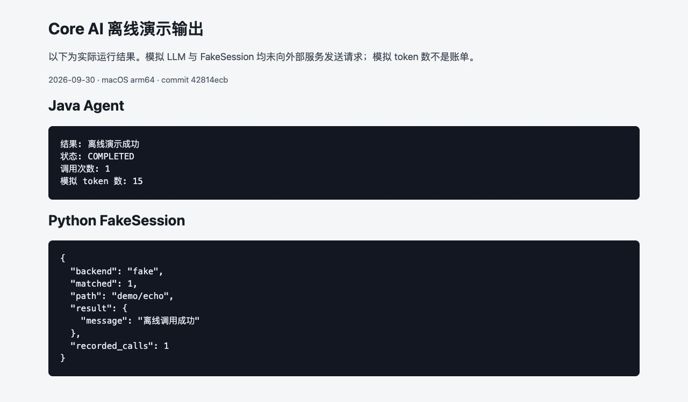

## 第一次使用，从这里开始

  <a href="/core-ai/cn/quickstart"><strong>01 · 确认环境</strong>选择角色、版本和安装路线</a>
  <a href="/core-ai/cn/framework#离线-agent"><strong>02 · 跑通离线演示</strong>无需真实凭据，先理解输入和结果</a>
  <a href="/core-ai/cn/manual/#_28-三部分协作实例"><strong>03 · 接入测试服务</strong>把 Server、CLI 和脚本连起来</a>

## 操作示例，带着预期结果阅读

  <a href="/core-ai/cn/server"><strong>Server：创建 Agent 并对话</strong>仓库历史界面 · 按步骤核对账号、模型与状态</a>
  <a href="/core-ai/cn/framework#离线-agent"><strong>框架：不调用模型的本地演示</strong>本次 Mac 实测 · Mock Agent 与 FakeSession</a>

## 遇到问题？从现象定位

[Windows / macOS CLI 排障](/cn/cli-troubleshooting) · [Server 常见问题](/cn/manual/#_8-server-常见问题) · [框架 API 与构建问题](/cn/manual/#_30-框架常见问题)

文档以 CLI 2.0.21 源码为基线。Mac help 与离线演示已实测；Server 启动、发布包安装、Windows 实机及线上模型调用未验证。完整手册保留每一步的验证范围。

