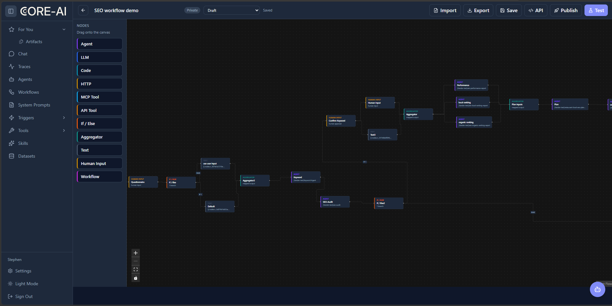

# Core AI 使用手册

面向开发者新手的 Server CLI 与框架操作指南

本手册帮助读者从确认环境开始，配置 Core AI Server、使用命令行发现和调用资源，并用 Java 框架编写 Agent。暂按有基本终端和编程经验的新手开发者编写。示例地址使用占位域名，凭据由读者在自己的授权环境中提供。

核对日期为 2026 年 9 月 30 日。发布核对基线是 `chancetop-com/core-ai` 仓库的 `master`，commit `e1afa9fab8a1c29981b6269329eca7885a578a24`。CLI 源码版本是 `2.0.21`；框架是 `1.4.0-SNAPSHOT`，公共 API 是 `1.3.0-SNAPSHOT`；Server 按共同 commit 追踪。本文的命令和类型按这一份代码整理，其他版本请先看实际 `--help`。

## 阅读方式与验证标识

**已实测**：在本次 Mac 上执行成功，有 `evidence/` 记录。**源码核对**：参数、字段或路径已与代码核对，未执行其联网操作。**未验证**：安装、服务启动或跨系统结果未在对应环境复现。源码核对不代表远程服务、权限和模型配置已可用。

本次已实测 2.0.19 和发布核对时 2.0.21 的 Java 源码离线编译、各 8 组 CLI help/version、一个 Mock Agent 和一个 Python FakeSession。运行环境为 macOS arm64、GraalVM Java 25.0.2、Python 3.13。未运行 Server、Docker、模型请求或生产接口；未安装发布版 CLI，未在 Windows 实机验证。文中的网络操作只有在读者配置自己的测试环境后才能执行。

| 部分 | 用途 | 最小环境 |
| --- | --- | --- |
| core-ai-server | 管理 Agent、工具、技能和数据集，提供 Web、REST、SSE | 容器运行时，MongoDB，Redis；模型服务另配 |
| core-ai-cli | 本地 Agent、编辑器 ACP，以及 Server Hub 资源命令 | 对应系统的原生二进制；源码方式需 Java 25 |
| core-ai 框架 | Java 应用内的 Agent、工具、上下文、记忆和 Flow | Java 25，Gradle Wrapper，所需依赖 |

三部分位于同一 monorepo。Server 和 CLI 均依赖 `core-ai` 与 `core-ai-api`。CLI 可以直接连接模型，也可以登录 Server 使用其模型代理。Hub 子命令负责资源操作；Python SDK 在本机调用 CLI，在沙箱使用会话 Hub，身份和权限随环境变化。

建议先阅读第二部分的 help 演示和第三部分的离线样例，再按需要启动第一部分服务。已有团队 Server 的读者可以直接使用管理员提供的地址和权限。

## 目录

第一部分 core-ai-server：环境与安装、配置、界面操作、会话 API、Gateway、排错。

第二部分 core-ai-cli：macOS 与 Windows 安装、登录与独立配置、核心操作、Hub、本地扩展、跨系统排错。

第三部分 core-ai 框架：源码依赖、Agent、工具、Streaming、上下文和进阶能力、三部分协作、离线演示、验证附录。

# 第一部分 core-ai-server

## 1 环境与准备

源码目录为 仓库中的 `core-ai-server/`。Web 界面在同仓库 `core-ai-frontend`。容器路线不要求宿主机安装 Java；源码构建要求 Java 25，Wrapper 为 Gradle 9.3.0，前端发布流程使用 Node 22。MongoDB 与 Redis 都是当前 Server 基础依赖。对象存储、向量库和沙箱按功能启用。

先确认目标环境是本地测试还是团队服务，确定管理员身份、可访问模型和工具权限。检查配置中的模型服务地址，仓库示例含开发环境地址，不应原样连接。默认管理员配置只在没有用户时用于初始化；修改环境变量不会自动重设已有用户的密码。

**未验证的环境检查命令**：

```sh
docker version
docker compose version
java -version
node --version
```

容器路线重点检查 Docker 与 Compose；源码路线还要检查 Java 和 Node。预期各命令能输出版本，Docker 客户端能连接自己的 Docker Engine。

## 2 使用仓库 Compose

仓库根 `docker-compose.local.yml` 包含 MongoDB 7、Redis 7、Server，以及 Mongo 副本集初始化任务。Server 暴露 8080 和 8443。它引用已有的 external 卷，还显式启用 Docker 沙箱，因而不是无条件的一键启动配置。

步骤 1：在自己的工作目录取得仓库并确认版本。已有 checkout 无需再次克隆。

```sh
git clone https://github.com/chancetop-com/core-ai.git
cd core-ai
git rev-parse HEAD
```

步骤 2：检查数据卷。以下命令只检查；缺失时在自己的测试环境创建，不删除已有卷。

```sh
docker volume inspect core-ai_mongo-data
docker volume inspect core-ai_redis-data
docker volume create core-ai_mongo-data
docker volume create core-ai_redis-data
```

external 卷由 Compose 外部管理，缺失时启动会失败。[Docker 数据卷说明](https://docs.docker.com/reference/compose-file/volumes/)。

步骤 3：复制 Compose 为本地配置后编辑。设置自己的管理员邮箱、密码、公开地址和模型；将 `SYS_SANDBOX_PROVIDER` 改为 `none` 可以先使用基础服务。删除仅服务于 Docker 沙箱的 socket 与 callback 覆盖项，包括 `CORE_AI_SERVER_OPTS` 内相关参数。需要沙箱时由环境管理员按已有基础设施配置，当前 Docker provider 要求可访问的 Engine API 和沙箱回连 URL。不要为完成这个教程开启未保护的 Docker TCP 端口。

建议将测试端口绑定到回环地址，例如 `127.0.0.1:8080:8080` 和 `127.0.0.1:8443:8443`，并移除不需要的 Mongo、Redis宿主端口映射。镜像 `latest` 会随时间变化；可复现部署应另行固定经团队确认的镜像版本或 digest，不能把它等同本文 commit。

步骤 4：检查自己的配置再启动。下面假设复制文件名为 `docker-compose.manual.yml`。

```sh
docker compose -f docker-compose.manual.yml config --quiet
docker compose -f docker-compose.manual.yml up -d
docker compose -f docker-compose.manual.yml ps
docker compose -f docker-compose.manual.yml logs --tail 100 core-ai-server
```

**预期结果**：Mongo 初始化完成，Redis 健康，Server 启动并监听配置端口。打开自己配置的 `SYS_PUBLIC_URL`。原仓库示例地址为 `https://localhost:8443`；HTTPS 证书需要与实际部署匹配。没有沙箱时，基础 UI 和服务仍有代码支持，沙箱 shell、文件工作区和会话 Hub 不会因此自动可用。以上启动流程未在本次执行。

停止本地服务可执行 `docker compose -f docker-compose.manual.yml stop`；重新开始用 `start` 或 `up -d`。保留数据卷以保存数据。

## 3 配置项与源码启动

ServerApp 读取 `sys.properties` 和 `agent.properties`。系统配置在 `core-ai-server/src/main/resources/sys.properties`；模型配置在同目录 `agent.properties`。当前属性名是 `sys.http.listen`，旧 README 中的 `sys.http.port` 不适用于此基线。

| 属性 | 对应环境变量 | 用途 |
| --- | --- | --- |
| sys.http.listen | SYS_HTTP_LISTEN | HTTP 端口，示例 8080 |
| sys.https.listen | SYS_HTTPS_LISTEN | HTTPS 端口，示例 8443 |
| sys.mongo.uri | SYS_MONGO_URI | Mongo URI，副本集方式见 Compose |
| sys.jedis.host 与 port | SYS_JEDIS_HOST 与 PORT | Redis 主机和端口 |
| sys.public.url | SYS_PUBLIC_URL | 浏览器访问服务的地址 |
| sys.admin.email 与 password | SYS_ADMIN_EMAIL 与 PASSWORD | 空库管理员初始化 |
| sys.sandbox.provider | SYS_SANDBOX_PROVIDER | none、docker、kubernetes 或 agent-sandbox |

LiteLLM 配置样例只展示属性名。实际 base 应由模型服务管理员提供，模型名称必须存在。

```properties
litellm.api.base=https://llm.example.com/v1
litellm.api.key=<YOUR_TEST_KEY>
llm.model=<AVAILABLE_MODEL>
llm.temperature=0.7
```

源码构建使用仓库 Wrapper，不需要另装全局 Gradle。根构建定义 `:core-ai-server:installDist`，还会触发前端 npm 安装与构建；首次运行需要下载依赖。

```sh
./gradlew :core-ai-server:installDist
```

Windows 使用 `./gradlew.bat :core-ai-server:installDist`。产物在根 `build/core-ai-server/install/core-ai-server/`；启动脚本位于其 `bin`，前端产物复制到 `web`。先在测试环境中配置 Mongo、Redis、管理员和模型，再使用生成的启动脚本。此 Gradle 分发构建和 Server 启动未运行验证，本次只编译了 API、框架和 CLI。

## 4 从 Web 界面完成第一个 Agent

以下是按界面文档和前端实现整理的操作路径。图 1 至图 3 来自仓库真实历史截图，最后相关提交为 `5f139305`，2026 年 7 月 6 日。本次未重新登录 Server；不同版本的按钮文字可能略有变化。

步骤 1：访问自己的 Server 地址并登录。在 Agents 页面新建 Agent，填写名称、描述、system prompt 和管理员提供的模型名称。首次练习可写“用中文简洁回答”，先不绑定可修改外部数据的工具。

步骤 2：保存 draft。检查工具、skills、sub-agents、最大轮数与权限。需要给其他用户或正式运行使用时，按权限发布版本；草稿和已发布快照是不同生命周期，保存不等于发布。

步骤 3：打开该 Agent 的 Chat，发送一条简单问题。在模型、额度和身份配置正确时，预期看到流式回复、最终结果和状态变化；若工具需要审批，先检查名称和参数，再决定是否批准。


图 1 展示已有 Agent 列表，用于定位管理入口；截图中的用户和 Agent 是历史示例，不能视作本次创建结果。


图 2 展示历史对话和文件预览。生成文件依赖 Agent 配置、工具和沙箱能力；预览出现不代表文件已自动公开共享。需要交付时检查文件下载、可访问范围及有效期。

步骤 4：在 Traces 查看该次调用。按 session、agent 或 trace ID 定位，检查耗时、状态、模型调用和工具结果。出现错误时先定位失败步骤，再看服务配置或权限；不要把完整含凭据的调试日志贴入共享文档。

## 5 工具 技能 数据集与工作流

工具通过 MCP 或 Service API 注册。先确认服务可访问与认证方式，再查看工具输入 schema；Agent 只应加载任务所需工具。Skills 是包含 `SKILL.md` 和资源的可复用包，脚本依赖与权限仍需环境提供，安装 skill 本身不会授予外部账号权限。

数据集绑定到 Agent 或会话时包含类型和权限。`SESSION` 是会话状态，使用 get/set/patch；`GENERAL` 是记录集合，使用 query/insert/update/delete。两类操作不能互换，同名绑定有歧义时使用规范 ID。

工作流页面用于连线、设置节点输入和条件、测试并发布。先用最小 START → 一个节点 → END 验证数据流，再添加分支和需要人工输入的节点。节点参数和连线必须以当前 UI/schema 为准，不直接照抄历史图中的完整业务流程。



图 3 展示多节点编排。单个节点测试、整条流程测试和发布后运行分别检查；运行历史可用于定位失败节点。该图中的业务流程未在本次运行。

## 6 使用会话 REST 与 SSE

这一节的路由和 JSON 字段均为源码核对，网络请求未执行。示例采用 macOS/zsh 的 `curl`；Windows 请用 `curl.exe`，或按 PowerShell 原生 HTTP API 改写。示例中的 `<AGENT_ID>`、`<SESSION_ID>` 与 `CORE_AI_API_KEY` 必须由自己的测试环境提供，不能保留尖括号值直接执行。

认证路由包括 `POST /api/auth/login`，请求是 `email` 与 `password`，返回包含 `api_key`。CLI 登录流程可避免把密码写入脚本。普通用户 key、API-user 的 `ctk_`/`cmk_` key 与沙箱 `cst_` 会话 token 的适用入口不同，不能因都是 Bearer 就互换。

步骤 1：创建会话。`agent_id` 是请求字段，响应 ID 是 **`sessionId`**，命名故意保持实际实现。

```sh
export CORE_AI_SERVER='https://core-ai.example.com'
# CORE_AI_API_KEY 通过自己的安全配置提供
curl -sS -X POST "$CORE_AI_SERVER/api/sessions" \
  -H "Authorization: Bearer $CORE_AI_API_KEY" \
  -H 'Content-Type: application/json' \
  --data '{"agent_id":"<AGENT_ID>"}'
```

预期 HTTP 201，响应有 `sessionId`，还可能有 `loaded_tools`、`loaded_skills`、`loaded_sub_agents`。记录真实 sessionId 后赋给 `CORE_AI_SESSION_ID`。创建 DTO 也支持 `config`、`tools`、`skill_ids`、`sub_agent_ids`、`dataset_configs`；初次调用优先使用已经配置好的 Agent。

步骤 2：在另一个终端连接事件流。方法是 **PUT**，query 参数是 **`agent-session-id`**。

```sh
curl -N -sS -X PUT \
  "$CORE_AI_SERVER/api/sessions/events?agent-session-id=$CORE_AI_SESSION_ID" \
  -H "Authorization: Bearer $CORE_AI_API_KEY" \
  -H 'Accept: text/event-stream'
```

预期连接保持打开，收到 SSE 事件。事件内容随子类型而变，包含 type、sessionId、timestamp 等基础字段。不是每条事件都是完整回复；客户端按事件类型处理增量与结束状态。

步骤 3：发送消息。必填是 `message`；可选 `variables` 为字符串映射、`attachments` 为附件列表。

```sh
curl -sS -X POST \
  "$CORE_AI_SERVER/api/sessions/$CORE_AI_SESSION_ID/messages" \
  -H "Authorization: Bearer $CORE_AI_API_KEY" \
  -H 'Content-Type: application/json' \
  --data '{"message":"请用中文介绍你的用途"}'
```

此接口不返回最终模型文本；结果经事件流、历史或状态查询读取。查询状态使用 `GET /api/sessions/<id>/status`，历史用 `/history`，信息用 `/api/sessions/<id>`。

步骤 4：若收到工具审批请求，取事件中的实际 call ID，检查参数后调用 approve：

```json
{"call_id":"<ACTUAL_CALL_ID>","decision":"APPROVE"}
```

对应 `POST /api/sessions/<id>/approve`。合法 decision 为 `APPROVE`、`APPROVE_ALWAYS`、`APPROVE_SESSION`、`DENY`、`DENY_ALWAYS`；初次演示优先单次决定，持久授权由读者按环境权限判断。

步骤 5：停止执行用 `POST /api/sessions/<id>/cancel`；结束并关闭会话用 `DELETE /api/sessions/<id>`。取消任务和关闭会话是不同操作。

## 7 模型 Gateway

当前 Gateway 提供 `GET /api/gateway/v1/models`、`POST /api/gateway/v1/chat/completions`、`responses`、`images/generations`、`images/edits`、`videos` 等路由，实际模型能力还受后端供应商和账户配置限制。`/api/cli/v1` 是 CLI 登录后使用的代理入口，不能直接当成所有外部客户端的 Gateway base。

先用有权限的身份读取 models，再选择支持目标能力的模型和客户端。视频等长任务需要按相应路由查状态与取内容。仓库 `core-ai-server/examples/python/` 有已有示例及历史测试记录；它们不是本次验证结果，也不应原样连接其中的环境地址。

## 8 Server 常见问题

| 症状 | 优先检查 | 处理与预期结果 |
| --- | --- | --- |
| external volume not found | 卷名称与 docker context | 在目标测试 Engine 创建缺失卷后再启动 |
| Mongo 连接或事务报错 | URI、rs0 初始化、网络 | 对照 Compose 副本集参数，等待初始化完成 |
| 会话排队或状态异常 | Redis、服务日志 | 确认 Redis 可连接及 sys.jedis 配置 |
| 网页可开但模型报错 | base、key、model、额度 | 用管理员提供的测试配置核对供应商 |
| SSE 无增量 | PUT、agent-session-id、身份、代理缓冲 | 对照第 6 节，确认会话属于可访问用户 |
| shell 或 sandbox 不可用 | provider、Engine API、callback、会话 token | 基础服务 none 模式不具备沙箱能力 |
| 改初始化密码无效 | Mongo 已有用户 | 用账户管理流程更新，初始化配置只作用于空库 |

本表为源码排错方向，未复现 Server 故障。先保留最小错误、状态码和脱敏日志，再进一步诊断。

# 第二部分 core-ai-cli

## 9 选择安装方式

源码目录为 仓库中的 `core-ai-cli/`。当前 Main 支持 7 个 Hub 分组：`mcp`、`skill`、`api-tool`、`agent`、`report`、`dataset`、`catalog`。原生二进制已包含运行时，不要求安装 Java；从源码构建需要 Java 25，native build 需匹配 GraalVM。

官方发布页在 [Core AI Releases](https://github.com/chancetop-com/core-ai/releases)。代码约定 macOS 资产为 `core-ai-cli-darwin.tar.gz`，Windows 为 `core-ai-cli-windows.zip`；包内分别是 `core-ai-cli-darwin`、`core-ai-cli-windows.exe`。资产名称没有标明处理器架构，安装前核对对应版本 release 信息与架构，本文不能保证 Intel Mac 或 Windows ARM 兼容。

下面提供用户目录安装方式，假设已经从自己确认的 release 下载对应文件到 Downloads。本次固定版本下载没有完成，因此发布包下载、安装和原生执行均未验证。

## 10 macOS 安装与检查

步骤 1：解包到独立目录，再安装到自己的 bin。

```sh
mkdir -p "$HOME/Downloads/core-ai-cli-unpack" "$HOME/.core-ai/bin"
tar -xzf "$HOME/Downloads/core-ai-cli-darwin.tar.gz" \
  -C "$HOME/Downloads/core-ai-cli-unpack"
file "$HOME/Downloads/core-ai-cli-unpack/core-ai-cli-darwin"
```

预期 `file` 显示 Mach-O 与处理器架构。确认和本机 `uname -m` 匹配后：

```sh
cp "$HOME/Downloads/core-ai-cli-unpack/core-ai-cli-darwin" \
  "$HOME/.core-ai/bin/core-ai-cli"
chmod u+x "$HOME/.core-ai/bin/core-ai-cli"
export PATH="$HOME/.core-ai/bin:$PATH"
core-ai-cli --version
core-ai-cli --help
```

`chmod` 仅作用于自己的这一个文件，教程未执行该安装操作。选择相应 release 后预期输出对应版本；安装 2.0.21 时应是 2.0.21。

步骤 2：需要长期使用时，把以下一行加入自己所用 shell 的启动文件。zsh 交互终端通常使用 `~/.zshrc`，bash 按自己的登录方式选择 `~/.bash_profile` 或 `~/.bashrc`，避免重复添加。

```sh
export PATH="$HOME/.core-ai/bin:$PATH"
```

重新开终端后执行 `command -v core-ai-cli`。预期指向用户 bin。若 Gatekeeper 阻止，先核对下载来源和架构，再按 [Apple 官方打开应用流程](https://support.apple.com/en-us/102445) 操作；本文不要求关闭系统保护。

## 11 Windows 安装与检查

以下是源码和官方 shell 行为核对，**未在 Windows 实机执行**。使用 PowerShell，路径有空格时保留引号。

步骤 1：解包并复制到用户 bin。

```powershell
$cliBin = Join-Path $env:USERPROFILE '.core-ai\bin'
$unpack = Join-Path $env:TEMP 'core-ai-cli-unpack'
New-Item -ItemType Directory -Force -Path $cliBin,$unpack | Out-Null
Expand-Archive -Path "$env:USERPROFILE\Downloads\core-ai-cli-windows.zip" `
  -DestinationPath $unpack -Force
Copy-Item (Join-Path $unpack 'core-ai-cli-windows.exe') `
  (Join-Path $cliBin 'core-ai-cli.exe')
$env:Path = "$cliBin;$env:Path"
& (Join-Path $cliBin 'core-ai-cli.exe') --version
core-ai-cli --help
```

步骤 2：长期 PATH 用 Windows 设置中的“编辑账户的环境变量”，在用户 Path 添加 `%USERPROFILE%\.core-ai\bin`，保留其他条目。重新开终端执行：

```powershell
Get-Command core-ai-cli -All
where.exe core-ai-cli
```

预期找到新路径与期望版本。PowerShell 执行当前目录二进制要写 `./core-ai-cli.exe`；带空格的完整路径使用调用运算符 `&`。不要把 `&` 复制到 cmd.exe。已运行程序占用 exe 时先正常退出，再更新；教程不要求管理员权限或修改全局执行策略。

## 12 本次已验证的 CLI 演示

本次使用当前 API、框架、CLI 共 1265 个 Java 源文件与本机缓存依赖离线编译到任务目录，以 JVM 执行 Main。发布核对时下列 8 组命令都返回 0，version 为 2.0.21；初次检查的 2.0.19 也全部通过：

```text
core-ai-cli --version
core-ai-cli --help
core-ai-cli mcp --help
core-ai-cli mcp call --help
core-ai-cli agent run --help
core-ai-cli dataset --help
core-ai-cli report push --help
core-ai-cli catalog --help
```

这些命令名是发布版形式；本次实际底层执行为 `java -cp <本机离线类路径> Main ...`，不是 native release 的运行证明。详情在 `evidence/cli-help-run-current.json`、初次记录 `evidence/cli-help-run.json` 和对应文本。


图 4 展示初次核对的 2.0.19 stdout，在本地浏览器显示后截图，不是终端截图，也不是 Windows 截图。已有 checkout 中旧 native 文件返回 1.0.39，因此本文没有使用它证明 2.0.19 或 2.0.21。

## 13 登录 Server 或独立配置模型

路线 A：管理员已经提供 Core AI Server。显式指定地址，避免首次交互默认环境造成误连。

```sh
core-ai-cli --login=https://core-ai.example.com
```

按交互完成浏览器回调或粘贴自己的 API key。凭据记录在 `~/.core-ai/auth.json`；Windows 通常是 `%USERPROFILE%\.core-ai\auth.json`。不要提交或分享这个文件。没有显式 `litellm.api.base` 时，已登录身份会注入 `<server>/api/cli/v1` 为代理 base；可用模型由 Server 决定。

路线 B：不使用 Server 模型代理。在 `~/.core-ai/agent.properties` 配置自己的兼容端点：

```properties
active.provider=litellm
litellm.api.base=https://llm.example.com/v1
litellm.api.key=<YOUR_TEST_KEY>
llm.model=<AVAILABLE_MODEL>
llm.temperature=0.7
agent.max.turn=20
agent.memory.enabled=false
```

保存文件后再启动，未配置时首次启动可能进入配置向导。`--config` 指定替代全局配置文件；workspace 的 `.core-ai/agent.properties` 仍可覆盖其值。LiteLLM 由 base 激活，key 可以为空以适配不要求认证的端点；OpenAI 注册要求 key 并读取必需 base；Azure 检查 key 与 base；OpenRouter 与 DeepSeek 使用固定服务 base。按自己选的 provider 配置，不混用属性名。

**预期结果**：命令进入交互会话，能选择可用模型。登录、模型联网与以下 prompt 均为源码核对，未在本次调用。

## 14 核心操作与会话恢复

```sh
core-ai-cli --workspace /path/to/my-project
core-ai-cli --model <AVAILABLE_MODEL> --prompt '请概括当前任务'
core-ai-cli --continue
core-ai-cli --resume
```

Windows 路径例为 `--workspace 'C:\work\my-project'`。`--prompt` 发一条输入、打印回复后退出；根命令还有 `--time-limit-seconds`，用于 Agent 墙钟限制，但返回后提取和清理仍会执行，不应把它视为整个进程严格秒级中止。

交互中先输入 `/help` 查看实际命令。常用 `/model`、`/model <name>`、`/resume`、`/login <server-url>`、`/memory search <keyword>`、`/agents`、`/exit`。`/model` 保存配置的代码路径指向全局 agent.properties，即使启动时用了 `--config` 也应核对实际保存位置。

工具审批出现时查看工具名称、目标路径或外部资源与参数。根参数 `--dangerously-skip-permissions` 会跳过所有工具审批，首次练习不需要它。调试信息可用 `--debug`，共享前先脱敏。

`--acp-agent` 是编辑器的 ACP stdio 模式，需要编辑器支持协议。配置其可执行程序为 CLI、参数为 `--acp-agent`，并设置工作目录。协议通道供客户端通信，不作为普通 REPL 使用。本文未运行 ACP 集成。

## 15 配置和资源路径

路径基于 Java `user.home`。下表中的 `~` 在 macOS 通常为 `/Users/<user>`，Windows 通常为 `C:\Users\<user>`；服务账户、IDE 和终端可能采用不同 home。

| 内容 | 全局或工作区位置 |
| --- | --- |
| 模型与 Agent 配置 | ~/.core-ai/agent.properties；workspace/.core-ai/agent.properties |
| 登录凭据 | ~/.core-ai/auth.json |
| 会话 | ~/.core-ai/sessions/<workspace目录名>/ |
| 工作区指令 | workspace/.core-ai/AGENTS.md；其次 workspace/AGENTS.md |
| 本地 MCP | workspace/.core-ai/MCP.json |
| hooks | workspace/.core-ai/hooks.json |
| skills agents plugins | ~/.core-ai/ 下和 workspace/.core-ai/ 下对应目录 |

当前 `/init` 创建 `.core-ai/AGENTS.md`。指令加载先查 `.core-ai/` 再查工作区根目录，每处按 AGENTS.md、instructions.md、CLAUDE.md 顺序选第一个存在文件。

配置覆盖顺序是工作区值覆盖全局或 `--config` 文件值。Hub 认证采用显式 `--server`、`--api-key` 优先，然后环境变量 `CORE_AI_SERVER`、`CORE_AI_API_KEY`，再读取登录记录；指定 server 时只使用匹配该 URL 的记录。不要把实际 key 放在命令行、截图或 shell 历史中。

会话目录使用工作区最后一段名称，两个不同父目录的同名工作区存在混淆风险，这是源码推断。需要恢复时确认工作区与会话内容。

## 16 Hub 先搜索再描述再调用

Hub 命令访问 Server，不启动本地 LLM Agent。根命令已经没有 `--server`、`--api-key`、`--serve` 或 `--headless`；`--server` 和 `--api-key` 在 Hub 子命令中仍可用。最稳妥的流程是发现可见资源，读取 schema，再调用实际返回的 path。

步骤 1：只读发现。以下都是联网命令，本次未执行。

```sh
core-ai-cli catalog --json
core-ai-cli mcp search echo --json
core-ai-cli mcp describe demo/echo --json
```

`demo/echo` 是离线样例名；实际服务不保证存在。替换为 search 返回的 `server/tool`。预期 search 列出匹配项，describe 显示输入 schema 和描述；空结果说明当前身份看不到匹配工具，不能据此猜名继续调用。

步骤 2：按 schema 创建 `args.json`，再调用：

```json
{"text":"你好"}
```

```sh
core-ai-cli mcp call demo/echo --args-file args.json --json
```

工具执行的副作用由具体工具决定。`--args` 提供 JSON 字符串；`--args-file -` 从 stdin 读取；`--arg name=value` 按工具 schema 做类型转换。跨平台优先使用 args 文件。MCP 默认 timeout 为 60 秒，允许最大 300 秒；`--max-output` 默认 64 Ki 字符，`--out-dir` 用于保存图片结果。以实际 help 为准。

## 17 Agent Skill API 与报告

| 场景 | 命令流程 | 要点 |
| --- | --- | --- |
| 远程 Agent | agent search → agent show → agent run | 运行参数是 id 或唯一名称 |
| Skill | skill search → skill show → skill pull | pull 安装包，仍受工具权限限制 |
| Service API | api-tool search → describe → call | 按返回的完整路径和 schema |
| 报告 | report projects list → report push | 需要 project 和 subject |

```sh
core-ai-cli agent search <keyword> --json
core-ai-cli agent show <AGENT_ID> --json
core-ai-cli agent run <AGENT_ID> --task '请完成测试任务'
core-ai-cli agent status <TASK_ID>
core-ai-cli skill pull <namespace/name> --workspace
core-ai-cli report projects list --json
core-ai-cli report push report.html --project <PROJECT_ID> --subject <SUBJECT_ID>
```

`agent run` 支持 `--task-file`、`--context-id`、重复 `--attach`、`--detach`。默认等候 120 秒，最大 300 秒；超时仍可能有远程运行，用返回 task ID 查状态。需要用户输入的状态返回退出码 7，可按 `agent reply --help` 的实际契约回复。Skill 的 `--workspace` 会写当前目录 `.core-ai/skills`；`--to` 可指定其他目录，`--force` 会覆盖，应先确认本地修改。

报告发布是外部写入，上传前确认文件、project、subject 和权限。本文只核对 help，没有发布报告或上传 skill。

## 18 会话数据集与退出码

```sh
core-ai-cli dataset list --session <SESSION_ID> --json
core-ai-cli dataset show <DATASET_ID> --session <SESSION_ID> --json
core-ai-cli dataset state get <DATASET_ID> --session <SESSION_ID> --json
```

`--session` 或 `CORE_AI_SESSION_ID` 指定会话边界。先 list 查看绑定类型和权限，再选择 state 或 records 操作。写入参数请执行 `dataset state set --help`、`patch --help` 或 `dataset records insert --help` 核对，读权限不能升级为写权限。

| Hub 退出码 | 含义 | 下一步 |
| --- | --- | --- |
| 0 | 成功 | 读取结果 |
| 1 | 工具或服务执行失败 | 查看错误信息 |
| 2 | 参数或用法错误 | 查看对应 --help |
| 3 | 未认证 | 核对登录、server、匹配记录 |
| 4 | 无权限 | 查看资源授权 |
| 5 | 未找到 | 重新 discovery |
| 6 | 等待超时 | 查 task 状态，避免重复执行 |
| 7 | Agent 等用户输入 | 查看要求并回复 |

这些是 Hub 约定，不能套用于所有第三方程序。macOS 查看 `$?`；PowerShell 查看 `$LASTEXITCODE`。

## 19 本地 MCP Skills 与 hooks

本地 MCP 配置和 `core-ai-cli mcp ...` 的 Server 工具目录是两个入口。本地 `.core-ai/MCP.json` 配置可由外部进程提供 stdio 工具；仓库对应 references 为 `docs/skills/core-ai-cli-manual/references/mcp.md`。先使用自己的可离线运行 MCP 服务，按其实际 command、args、env 配置，再确认 CLI 加载结果。不要把 auth 数据写进共享包。

Skill 通常包含 `SKILL.md`、scripts 和资源。优先使用 Hub pull 或已审核的本地目录；在同名情况下工作区资源可以覆盖全局资源。Plugins 和 custom agents 也有各自目录和加载规则，复制前核对当前 references，不把第三方配置格式直接当成本项目格式。

hooks 在某些生命周期执行命令，脚本应先独立测试。当前 `ScriptHookRunner` 固定通过 `sh -c` 启动，Windows 仅有 PowerShell 时可能缺少 sh。这个问题是源码推断，未在 Windows 重现；可以先不启用 hooks，需要时由环境提供受控 sh，不能将 PowerShell 脚本不加转换就放入 sh 命令。

## 20 Windows 常见问题与解决步骤

本节全部为源码推断或官方 shell 行为说明，未标成 Windows 已验证。

| 症状 | 诊断命令或检查 | 解决步骤 |
| --- | --- | --- |
| 找不到命令 | Get-Command 与 where.exe | 确认 exe 名称，添加用户 PATH，重开终端 |
| 新装仍是旧版 | Get-Command -All | 使用新 exe 完整路径；移除或调整旧 PATH 条目 |
| 路径含空格失败 | 查看引号与调用方式 | 用 & '完整路径.exe'；工作区路径加引号 |
| JSON 参数被改变 | 用 args 文件复测 | 采用 --args-file，避免多层引号 |
| 配置读不到或乱码 | 文件扩展名、home、编码 | 防止 .properties.txt；按 Java Properties 规则保存 |
| hook 无法启动 sh | Get-Command sh | 暂不启用 hook，或使用受控 sh 环境 |
| 升级无法替换 exe | 有无正在运行会话 | 正常退出旧进程；安装到自己的 bin 后重试 |
| 脚本说 Bash 命令无效 | 当前 shell 与命令语法 | 按实际 PowerShell/cmd 语法写命令 |

CLI 的系统 shell 检测优先 `pwsh.exe`、`powershell.exe`、`cmd.exe`，虽然工具名可能叫 `run_bash_command`，Windows 不因此必然运行 Bash。`export X=...` 是 Unix 语法，PowerShell 用 `$env:X='...'`；cmd 使用 `set X=...`。zsh/bash 多行续行是反斜杠，PowerShell 是反引号且必须为行末最后字符，cmd 是 `^`。示例尽量使用文件减少转义层次。[PowerShell 参数解析](https://learn.microsoft.com/en-us/powershell/module/microsoft.powershell.core/about/about_parsing)。

PowerShell 7 与 Windows PowerShell 5.1 默认文件编码有差异。JSON 文件建议 UTF-8；5.1 的 UTF8 选项可能带 BOM，需要工具兼容性核对。Java `Properties.load(InputStream)` 使用 properties 编码规则，中文可用 `\uXXXX` 转义；Windows 路径在 properties 值中使用 `/` 或正确转义反斜杠。不要仅靠文件看起来正常判断读取成功。[PowerShell 编码说明](https://learn.microsoft.com/en-us/powershell/module/microsoft.powershell.core/about/about_character_encoding)。

升级代码使用 Windows 延迟替换 helper，涉及 PowerShell 子进程和文件占用。企业策略阻止时采用经管理员允许的 release 手动替换路线；本文不建议更改全局执行策略。

## 21 macOS 常见问题与解决步骤

| 症状 | 诊断 | 处理 |
| --- | --- | --- |
| command not found | command -v；echo "$SHELL" | 确认用户 bin 已加入实际 shell 的 PATH |
| permission denied | ls -l 目标文件 | 确认自己拥有文件，对该文件设置用户执行位 |
| bad CPU type | file；uname -m | 获取明确支持本机架构的资产 |
| 系统阻止打开 | 下载来源、官方 release | 按 Apple 官方流程核对后由用户打开 |
| 版本没有变化 | command -v；type -a | 清理旧路径影响，直接调用新二进制复测 |
| IDE 可执行路径错误 | IDE 环境和工作目录 | 使用完整路径，并设置实际 workspace |
| properties 路径异常 | 文件值中的反斜杠 | 采用 /，检查转义与工作区覆盖配置 |

`--upgrade` 下载最新版本，`--upgrade-dir` 可指定安装目录。代码在当前二进制目录不能写时选择 `~/.core-ai/bin`；升级后再次确认 PATH 和 `--version`。本次没有执行升级。源码运行的 Java 25 不等于发布版 native 程序也需要 JVM。

# 第三部分 core-ai 框架

## 22 环境与依赖

框架源码目录为 仓库中的 `core-ai/`，公共类型为同仓库 `core-ai-api`。框架版本常量 `1.4.0-SNAPSHOT`，公共 API `1.3.0-SNAPSHOT`。不能据此保证这两个 SNAPSHOT 已在公共仓库发布，首次开发建议使用同一 checkout 的 Gradle project 依赖。

同仓库现有模块使用：

```kotlin
dependencies {
    implementation(project(":core-ai"))
    implementation(project(":core-ai-api"))
}
```

新模块还需要在 settings.gradle.kts 注册，并遵循项目的 Java 25 构建约定。独立仓库应使用团队提供的 Maven 发布坐标或 composite build 配置，不按旧教程假设制品已经存在。

构建框架的命令为 `./gradlew :core-ai:classes :core-ai-api:classes`；Windows 用 `gradlew.bat`。这是按 Gradle Java 插件核对的构建路线，未在本次用 Wrapper 运行。本次采用缓存 classpath 和 javac 的隔离离线编译，详情及可重复脚本见下一节。

## 23 不调用模型的第一个 Agent

这是本次**已实测**的 Java 演示，使用仓库测试支持类 `MockLLMProvider`，不发送网络请求。`examples/java/OfflineAgentDemo.java` 是完整源文件，Mock 类复制自仓库 test support；它不是框架正式 provider。

关键代码如下：

```java
var provider = new MockLLMProvider();
provider.addResponse(CompletionResponse.of(
    List.of(Choice.of(FinishReason.STOP,
        Message.of(RoleType.ASSISTANT, "离线演示成功"))),
    new Usage(10, 5, 15)));
var agent = Agent.builder()
    .name("manual-demo")
    .description("无网络的手册演示")
    .llmProvider(provider)
    .model("mock-model")
    .systemPrompt("请用中文回答")
    .compression(false)
    .maxTurn(3)
    .build();
var context = ExecutionContext.builder()
    .userId("demo-user")
    .sessionId("demo-session")
    .build();
String result = agent.run("测试", context);
```

复现步骤：解压附件，在 Java 25 与 Python 可用的终端执行以下命令。脚本要求指定 checkout 已有 Gradle/SpotBugs auxclasspath 和本地依赖缓存；依赖不足时会停止，不下载网络依赖，不修改 checkout。

```sh
python3 examples/run_offline_java.py \
  --repo /path/to/core-ai \
  --build-dir /tmp/core-ai-manual-build
```

Windows 可用 `python` 替代 `python3` 并传入自己的路径，但此脚本未在 Windows 测试。预期打印：

```text
结果: 离线演示成功
状态: COMPLETED
调用次数: 1
模拟 token 数: 15
```

15 是预设模拟 Usage，不代表真实计费。`Agent.builder()` 返回 AgentBuilder；`run` 返回字符串。旧教程里的 `Agent.execute` 与 `AgentOutput` 不能直接用于当前实现。

## 24 接入真实模型

当前通用兼容端点 provider 是 `ai.core.llm.providers.LiteLLMProvider`。它的构造函数为 `(LLMProviderConfig, url, token)`，URL 和 key 由调用方提供。

```java
import ai.core.agent.Agent;
import ai.core.llm.LLMProviderConfig;
import ai.core.llm.providers.LiteLLMProvider;

var config = new LLMProviderConfig(
    "<AVAILABLE_MODEL>", 0.7, "<EMBEDDING_MODEL>");
var provider = new LiteLLMProvider(
    config, "https://llm.example.com/v1",
    System.getenv("CORE_AI_MODEL_KEY"));
var agent = Agent.builder()
    .name("hello")
    .description("最小模型示例")
    .llmProvider(provider)
    .model("<AVAILABLE_MODEL>")
    .systemPrompt("用中文简洁回答")
    .maxTurn(5)
    .build();
String answer = agent.run("介绍你的用途");
```

该代码片段按当前类型核对，模型请求未执行。base 应是供应商兼容 API base，不是任意网页地址；key 缺失、模型名错误、quota、网络与服务协议均可能导致失败。LLMProviderConfig 默认请求超时 300 秒、连接超时 3 秒，可以通过 `setTimeout(Long)`、`setConnectTimeout(Long)` 调整。

自定义 provider 继承 LLMProvider，需要实现 completion、stream completion、embeddings、rerankings、captionImage、name 等抽象契约。先阅读实际签名和现有实现，再决定哪些能力要明确拒绝或支持，避免返回成功空结果。

## 25 把 Java 函数作为工具

实际注解位于 `ai.core.api.tool.function`；转换器为 `ai.core.tool.function.Functions`。参数 name 与 description 必填，required 默认 true。

```java
import ai.core.api.tool.function.CoreAiMethod;
import ai.core.api.tool.function.CoreAiParameter;
import ai.core.tool.function.Functions;

public class EchoTools {
    @CoreAiMethod(name = "echo", description = "原样返回文字")
    public String echo(
        @CoreAiParameter(name = "text", description = "要返回的文字")
        String text) {
        return text;
    }
}
```

在 Agent builder 中加 `.toolCalls(Functions.from(new EchoTools()))`。反射读取公开的注解方法并产生 schema；模型是否选择调用由输入、prompt 与 provider 决定。`needAuth` 默认 false 只代表此注解默认值，不应作为外部系统已经授权的证据。涉及写入的工具应明确权限、失败行为和幂等性；测试先用 Echo 这类无副作用函数。

## 26 Streaming 与执行上下文

当前接口是 `ai.core.llm.streaming.StreamingCallback`，核心回调是 `onChunk(String)`，完成回调为无参数 `onComplete()`。不要照搬旧教程的 onToken 或带文本参数的 onComplete。

```java
import ai.core.llm.streaming.StreamingCallback;

var streamingAgent = Agent.builder()
    .name("stream-demo")
    .llmProvider(provider)
    .model("<AVAILABLE_MODEL>")
    .streaming(true)
    .streamingCallback(new StreamingCallback() {
    @Override public void onChunk(String chunk) {
        System.out.print(chunk);
    }
    @Override public void onComplete() {
        System.out.println();
    }
    @Override public void onError(Throwable error) {
        System.err.println(error.getMessage());
    }
    })
    .build();
String answer = streamingAgent.run("用三句话解释 Agent", context);
```

上述片段通过 builder 设置 streaming 和 callback，未执行真实流式模型。回调应避免阻塞和泄露敏感内容；日志与用户输出按应用需要处理。

ExecutionContext 承载 userId、sessionId、custom variables 等运行信息。应用应为不同用户和会话创建正确上下文，并在持久化、工具权限和日志中保持身份一致。无上下文的 `run(query)` 可用于简单调用，但生产应用不能据此省略身份管理。

状态包括 `INITED`、`RUNNING`、`WAITING_FOR_USER_INPUT`、`WAITING_FOR_ASYNC_TASK`、`COMPLETED`、`FAILED`。字符串输出并不是唯一结果依据；交互或异步任务中还要处理暂停、审批、续跑和最终状态。

## 27 记忆 压缩 RAG 与 Flow

这些能力需要按场景增加依赖与配置，本文提供当前代码入口。完整的外部存储、检索质量与持久化流程未在本次运行。

| 能力 | 当前源码入口 | 使用前确认 |
| --- | --- | --- |
| 压缩 | ai.core.context.CompressionConfig；AgentBuilder.compression | 阈值、模型与额外调用开销 |
| 统一记忆 | AgentBuilder.unifiedMemory；memory 实现 | 用户隔离、存储路径和提取模型 |
| RAG | ai.core.agent.RagPipeline；ai.core.rag.RagConfig | embeddings、文档解析、向量库与检索策略 |
| Flow | ai.core.flow.Flow、FlowNode、FlowEdge | 节点类型、边输入、状态与持久化 |
| 观测 | telemetry、FlowTracer 与 Server Traces | 身份、trace 关联、日志脱敏 |

先让一个 Agent 和无副作用工具完成任务，再逐项启用能力。关闭压缩只适合可控短样例；长任务会占用上下文。记忆提取可能增加模型调用。Milvus 与 HNSWLib 是独立 backend 模块，使用对应运行时依赖；不能只配置名称就假设库已被加载。

框架 Flow 和 Server Web 工作流编辑器属于不同层次。定义文件、节点模型和运行生命周期各有实现，不把 UI 导出的 JSON 直接当作 Java Flow API 的参数。

## 28 三部分协作实例

目标：在测试 Server 注册一个只读工具，让用户通过 CLI 发现和调用，再把同一操作写入 skill 脚本。以下联网协作未执行，只有第 29 节 FakeSession 部分已验证。

步骤 1：Server 管理员注册测试 MCP，检查工具 schema 并让目标用户可见。若最终在沙箱执行，把对应工具绑定到 Agent 会话，并启用所需沙箱及 session token 配置。不要假设本机用户能看到的资源都自动属于沙箱会话。

步骤 2：用户通过 CLI 显式登录该 Server，执行 search → describe → call，记录规范 path 和 input_schema。使用只读工具与测试输入，检查退出码及返回数据。

步骤 3：在 Python 3.11 或更新版本的隔离环境安装 SDK。仓库路线如下，安装会获取依赖，本次未执行安装动作：

```sh
python3 -m venv .venv
.venv/bin/python -m pip install -e /path/to/core-ai/sdk/core-ai-session
```

Windows 使用 `python -m venv .venv` 和 `.venv\Scripts\python.exe -m pip install -e ...`。SDK 需要 httpx >= 0.27。release wheel 随 sandbox runtime 发布，版本应与目标 runtime 对齐；不要将源码 pyproject 的 0.0.0 当作已发布版本。

步骤 4：脚本通过 `session()` 获取环境身份，读取 catalog 和 schema。只在确认真实工具后才调用，示例如下：

```python
from core_ai_session import session

with session() as s:
    hits = s.tools("echo", kind="mcp")
    print(hits)
    # 下一步使用 discovery 返回的实际 path
    # detail = s.describe("actual-server/actual-tool")
    # result = s.call(detail.path, {"text": "你好"})
```

在本机，SDK 通过已安装 CLI，以用户自己的登录权限调用；沙箱设置 `CORE_AI_HUB` 时使用会话 Hub，以会话绑定的能力执行。Hub 环境优先且不静默退回本机身份。脚本不保存 key。数据集本机操作还需 session ID；沙箱 token 已带会话边界。

步骤 5：把脚本和说明放入 skill，先通过 FakeSession 验证参数，再在自己的测试环境安装。文件发布或 dataset 写入由具体绑定决定，不能把权限失败当成工具名错误而换身份绕过。预期本机与沙箱使用相同业务脚本，但 catalog 与可见资源符合各自身份。

## 29 Python 离线演示与截图

`examples/fake_session_demo.py` 是本次已运行的完整演示。它构造 demo/echo 的 catalog fixture，不调用 `session()`，不读取凭据，不访问外部 API。

在 SDK 依赖已可用时，从附件根目录运行：

```sh
PYTHONPATH=/path/to/core-ai/sdk/core-ai-session \
  python3 examples/fake_session_demo.py
```

PowerShell 采用 `$env:PYTHONPATH='C:\path\core-ai\sdk\core-ai-session'`，再运行 `python examples/fake_session_demo.py`；此 Windows 命令未实测。

FakeSession 的关键用法如下：

```python
s = FakeSession(catalog=catalog)
hits = [t for t in s.catalog().tools
        if t.kind == "mcp" and "echo" in t.path]
detail = s.describe("demo/echo")
s.mcp["demo"]["echo"].returns('{"message":"离线调用成功"}')
result = s.mcp["demo"]["echo"](text="你好")
assert result.data == {"message": "离线调用成功"}
assert s.calls[0].arguments == {"text": "你好"}
```

预期 JSON 输出 backend=fake、matched=1、path=demo/echo、recorded_calls=1。当前 FakeSession 不支持 context manager，也没有 `.tools()`，这两点已实际复现，不能把真实 Session 的 helper 用法直接复制到 Fake。


图 5 为实际 stdout 的本地浏览器截图，完整原始输出在 evidence 中。两个演示均没有真实 token 消耗或外部写入。可先修改 fixture 的 text 和预期值来练习，再接真实资源。

## 30 框架常见问题

| 问题 | 解释与处理 |
| --- | --- |
| 找不到 Agent.execute 或 AgentOutput | 当前使用 run 返回 String，按第 23 节迁移 |
| 找不到 AzureOpenAIConfig 等旧类型 | 使用当前 provider 实现和构造函数，参考 LiteLLMProvider |
| onToken 无法 Override | 改用 StreamingCallback.onChunk；onComplete 无参数 |
| Java 21 编译失败 | 当前 toolchain 为 Java 25，检查 java 和 javac 路径 |
| Maven SNAPSHOT 找不到 | 使用同 checkout project 依赖，或向团队获取实际发布源 |
| Agent 没调用工具 | 检查注解 schema、prompt、工具列表与模型响应；不能保证每次调用 |
| 调用后还在等待 | 查看 NodeStatus，处理用户输入或异步任务 |
| FakeSession helper 报错 | 用 catalog().tools；不要 with FakeSession |

## 附录 A 本次验证矩阵

| 项目 | 结果 | 范围 |
| --- | --- | --- |
| 仓库路径、commit、版本 | 已核对 | 同一 Mac checkout |
| API 框架 CLI 1265 文件离线 javac | 通过 | Java 25，未跑完整 Gradle checks |
| 两个版本各 8 组 help/version | 全部 exit 0 | 2.0.19 与 2.0.21 源码 JVM；不是 native release |
| Java Mock Agent | COMPLETED，调用 1 次 | 离线，没有模型服务 |
| Python FakeSession | 1 次调用，参数断言通过 | Python 3.13/httpx 0.28.1 |
| Server Web 截图 | 3 张历史真实图 | 2026 年 7 月，未本次操作 |
| 本次输出截图 | 2 张已检查 | 浏览器呈现 stdout |
| Server REST SSE Gateway | 路由与 DTO 核对 | 未联网验证 |
| Docker 和 Server 启动 | 未运行 | 需自己的测试配置 |
| 发布版 native 安装升级 | 未验证 | 下载未完成 |
| Windows 安装、shell、hooks | 源码或官方说明 | 没有 Windows 实机 |

## 附录 B 源码与文档索引

以基线 commit 的这些路径为依据；后续版本重新核对实际代码。

| 主题 | 仓库相对路径 |
| --- | --- |
| 版本与 Java | buildSrc/src/main/kotlin/Versions.kt；project.gradle.kts；gradle/wrapper/gradle-wrapper.properties |
| 模块关系与任务 | settings.gradle.kts；build.gradle.kts |
| Server 启动配置 | core-ai-server/src/main/java/ai/core/server/ServerApp.java；src/main/resources/sys.properties |
| Session REST 与 DTO | core-ai-api/src/main/java/ai/core/api/server/AgentSessionWebService.java；session/ |
| SSE | core-ai-server/src/main/java/ai/core/server/SessionModule.java；web/sse/AgentSessionChannelListener.java |
| 沙箱与 Gateway | core-ai-server/src/main/java/ai/core/server/SandboxModule.java；GatewayModule.java |
| CLI 入口与路径 | core-ai-cli/src/main/java/Main.java；ai/core/cli/utils/PathUtils.java |
| CLI 认证配置 | ai/core/cli/auth/AuthManager.java；hub/HubCredentialResolver.java；config/ProviderConfigurator.java |
| CLI Hub 参数 | core-ai-cli/src/main/java/ai/core/cli/hub/ |
| CLI shell hooks 升级 | ShellUtil.java；ScriptHookRunner.java；upgrade/UpgradeDownloader.java |
| Agent 与 Streaming | core-ai/src/main/java/ai/core/agent/AgentBuilder.java；Node.java；ExecutionContext.java；llm/streaming/StreamingCallback.java |
| 工具注解与转换 | core-ai-api/.../CoreAiMethod.java；CoreAiParameter.java；core-ai/.../tool/function/Functions.java |
| Python SDK | sdk/core-ai-session/core_ai_session/；pyproject.toml |
| 当前参考手册 | docs/skills/core-ai-cli-manual/；docs/skills/core-ai-session-sample/ |

已有 `docs/cn/quickstart.md`、根 AGENTS.md 的构建环境说明、Server README 与部分 provider/streaming 教程存在版本差异，应结合当前代码使用。本次读取了根 AGENTS.md 和现有两个相关 SKILL.md；未发现 `.agents/skills`。工作区指令文件的变化已按发布时主分支更新，历史演示截图保留原始版本标注。

## 附录 C 交付资源

Word 与 Markdown 保留同一内容，可继续编辑。资源包包含 5 张截图、Java/Python 演示、离线 Java 编译运行脚本、8 组 CLI 输出与核对报告。源码脚本不会包含二进制、依赖缓存、auth.json 或真实凭据。

图 1 至图 3 是仓库历史 UI 截图；图 4 和图 5 是本次真实输出截图。没有录屏，图文步骤与可重复样例覆盖安全演示。本机旧 native 版本、本次未完成的下载和 Windows 未实测均已在适用章节说明。
