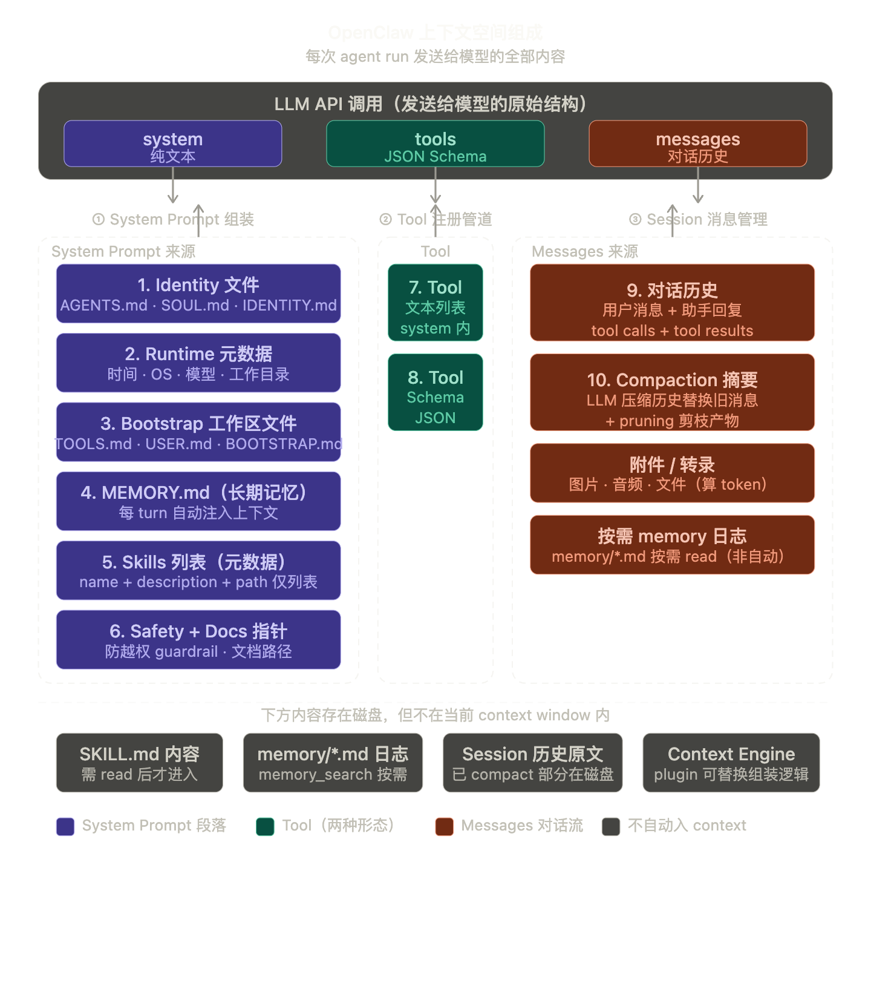

# OpenClaw 上下文管理架构

> 本文档系统性地梳理 OpenClaw 在一次 agent run 中如何管理上下文的各个组成部分，
> 包括 System Prompt、Tools、Session、Skills、Memory 等子系统的生命周期、更新机制和协作关系。

---

## 一、核心设计理念：无状态重建

OpenClaw 的上下文管理遵循一个核心原则：

> **每轮对话（agent run）的上下文从当前状态重建，而非在上一轮基础上修改。**

这意味着：
- System prompt 每轮重新组装
- Tool 列表每轮重新构建并过滤
- Skills prompt 按需从缓存或磁盘刷新
- 只有**消息历史**（conversation messages）是跨轮次累积的

```
                     ┌──────────────────────────────┐
                     │         agent run N           │
                     │                               │
   持久层            │   临时层（每轮重建）            │
   ─────            │   ──────────────              │
   消息历史 ────────►│   system prompt               │
   session store ──►│   tool 列表                    │
   磁盘文件 ───────►│   skills prompt               │
   config.yaml ───►│   bootstrap files             │
                     │   runtime info                │
                     │                               │
                     │        ▼                      │
                     │   LLM API 调用                 │
                     │   - system: 重建的 prompt 文本  │
                     │   - tools: 重建的 tool schema  │
                     │   - messages: 累积的消息历史    │
                     └──────────────────────────────┘
```

### 为什么这样设计

| 优势 | 说明 |
|------|------|
| 热更新 | 修改 SKILL.md、AGENTS.md、config.yaml，下一轮自动生效 |
| 无漂移 | prompt 始终反映当前磁盘和配置状态，不会和实际文件脱节 |
| 安全策略即时生效 | 修改 tool policy 后无需重启 |
| 简化状态管理 | 不需要维护"上一轮 prompt"的差异更新逻辑 |

---

## 二、上下文空间总览

OpenClaw 的上下文由以下 **10 个子系统** 协作构成：



---

## 三、System Prompt 组装

### 3.1 入口与流程

**核心文件**: `src/agents/system-prompt.ts` → `buildAgentSystemPrompt()`

每次 agent run 开始时，`attempt.ts` 调用：

```
resolveBootstrapContextForRun()   → 加载 bootstrap 文件（AGENTS.md 等）
resolveSkillsPromptForRun()       → 生成 skills prompt（可能走缓存）
buildEmbeddedSystemPrompt()       → 调用 buildAgentSystemPrompt() 组装完整 prompt
applySystemPromptOverrideToSession() → 替换 session 的 system prompt
```

### 3.2 Prompt 段落结构（25+ sections）

`buildAgentSystemPrompt()` 按顺序组装以下段落：

| # | Section | 内容 | 来源 |
|---|---------|------|------|
| 1 | **Tooling** | 可用 tool 名称 + 一句话描述 | tool 列表 |
| 2 | **Skills** | workspace 中的 SKILL.md 注册表 | skills prompt |
| 3 | **Memory Recall** | memory_search / memory_get 使用指引 | 配置 |
| 4 | **Workspace** | 工作目录路径、sandbox 桥接 | 运行时 |
| 5 | **Documentation** | 文档链接、schema 查询指引 | 配置 |
| 6 | **OpenClaw CLI** | 网关重启/配置/更新指引 | 固定文本 |
| 7 | **Self-Update** | config.apply / update.run 权限 | 配置 |
| 8 | **Model Aliases** | 模型别名覆盖 | 配置 |
| 9 | **Runtime** | agent ID、主机名、OS、shell、模型、thinking 级别 | 运行时 |
| 10 | **User Identity** | 授权发送者列表 | 配置 |
| 11 | **Time/Timezone** | 当前日期时间 | 系统时钟 |
| 12 | **Sandbox** | sandbox 运行时详情 | 运行时 |
| 13 | **Reply Tags** | `[[reply_to_current]]` 原生回复标签 | 频道能力 |
| 14 | **Messaging** | message tool、频道路由、inline buttons | 频道配置 |
| 15 | **Voice (TTS)** | 语音合成提示 | 配置 |
| 16 | **Safety** | 安全规则（不自我保护、不操纵、遵从停止） | 固定文本 |
| 17 | **Reasoning Format** | `<think>`/`<final>` 标签格式 | 配置 |
| 18 | **Reactions** | 表情回复指引（Telegram/Signal） | 频道能力 |
| 19 | **Silent Replies** | `OPENCLAWSILENT::` 静默回复协议 | 固定文本 |
| 20 | **Heartbeats** | `HEARTBEAT_OK` 确认协议 | 配置 |
| 21 | **Project Context** | MEMORY.md, SOUL.md, TOOLS.md, AGENTS.md 全文 | 磁盘文件 |

### 3.3 Prompt Mode

| Mode | 适用场景 | 包含段落 |
|------|---------|---------|
| `"full"` | 主 agent | 全部 25+ 段落 |
| `"minimal"` | subagent | 仅 Tooling、Workspace、Runtime |
| `"none"` | 极简模式 | 仅 identity 行 |

### 3.4 Hook 介入点

Plugin hooks 可以在 prompt 组装后修改最终结果：

```typescript
// src/plugins/hooks.ts → mergeBeforePromptBuild
{
  systemPrompt: "完全替换 system prompt",
  prependSystemContext: "在 prompt 开头追加",
  appendSystemContext: "在 prompt 末尾追加",
}
```

执行顺序：`buildEmbeddedSystemPrompt()` → hooks 修改 → `applySystemPromptOverrideToSession()`

---

## 四、Tool 注册管道

### 4.1 双通道架构

Tool 和 System Prompt 是 LLM API 的**两个独立参数**：

```
LLM API 调用
├── system: "你是一个助手..."          ← 纯文本（system prompt）
├── tools: [{ name, schema, ... }]    ← JSON Schema（tool 定义）
└── messages: [{ role, content }]     ← 对话历史
```

System prompt 中的 tool 信息只是**摘要**（名称 + 描述），实际的 JSON Schema 和执行函数通过 `customTools` 参数注册。

### 4.2 Tool 来源

每轮 agent run 从 4 个来源汇集 tool：

```
createOpenClawCodingTools()
  │
  ├── Base Coding Tools（pi-coding-agent SDK）
  │     read, write, edit, find, grep, ls
  │
  ├── OpenClaw Core Tools（createOpenClawTools()）
  │     browser, canvas, nodes, cron, message, tts,
  │     gateway, sessions_send, sessions_spawn, sessions_list,
  │     sessions_history, subagents, web_search, web_fetch,
  │     image, image_generate, exec, process, pdf ...
  │
  ├── Channel Tools（listChannelAgentTools()）
  │     whatsapp_login, 其他频道特定 tool
  │
  └── Plugin Tools（resolvePluginTools()）
        扩展注册的 tool

  + MCP Tools（createBundleMcpToolRuntime()）
        外部 MCP server 提供的 tool

  + Client Tools（toClientToolDefinitions()）
        OpenResponses 托管的 tool
```

### 4.3 Tool 策略过滤管道

Tool 从创建到最终注册，经过多层策略过滤：

```
全量 Tools
   │
   ▼ Profile Policy（工具集配置文件）
   │
   ▼ Global Allow/Deny Policy（全局策略）
   │
   ▼ Provider Policy（模型提供商策略，如 xAI 禁用 web_search）
   │
   ▼ Agent Policy（per-agent 策略）
   │
   ▼ Group Policy（频道/群组级别策略）
   │
   ▼ Sandbox Policy（沙盒限制）
   │
   ▼ Subagent Policy（子 agent 限制，禁用 gateway、cron 等）
   │
   ▼ Owner-Only Policy（owner-only tool 对非 owner 禁用）
   │
   ▼ Model Sanitization（如 Google 的 schema 限制）
   │
   ▼ 最终 Tool 列表 → createAgentSession({ customTools })
```

### 4.4 特殊限制

| 策略 | 受限 Tool | 说明 |
|------|----------|------|
| Owner-only | `cron`, `gateway`, `nodes`, `whatsapp_login` | 仅 owner 身份可调用 |
| Subagent deny | `gateway`, `cron`, `memory_search`, `sessions_send` 等 | 子 agent 默认禁用 |
| Leaf subagent deny | 上述 + `subagents`, `sessions_spawn` | 最深层子 agent 额外禁用 |
| Memory-flush trigger | 仅 `read`, `write` | memory flush 时极简 tool 集 |
| Voice provider | `tts` | 语音通道不需要 TTS tool |

---

## 五、Session 与消息历史

### 5.1 Session 是唯一的持久化对话容器

在"无状态重建"架构中，**消息历史是唯一跨轮次持久化的核心数据**。

```
Session
├── sessionKey: "agent:mybot:telegram:12345:dm"   ← 确定性派生
├── sessionId: "uuid"                              ← 唯一标识
├── messages: [...对话历史...]                      ← .jsonl 文件持久化
├── metadata:                                      ← session store
│     totalTokens, compactionCount,
│     skillsSnapshot, systemSent, ...
└── system prompt: (每轮重建，非持久化)
```

### 5.2 Session Key 格式

Session key 是确定性的，由消息上下文派生：

```
agent:{agentId}:{channel}:{senderId}:{threadOrDm}
```

示例：
- `agent:mybot:telegram:12345:dm` — Telegram 私聊
- `agent:mybot:discord:guild123:channel456` — Discord 频道
- `agent:mybot:subagent:uuid` — 子 agent session

### 5.3 Session Store 元数据

Session store（JSON 文件）持久化每个 session 的元数据：

```typescript
interface SessionEntry {
  sessionId: string;
  updatedAt: number;
  systemSent?: boolean;
  totalTokens?: number;
  totalTokensFresh?: boolean;
  inputTokens?: number;
  outputTokens?: number;
  compactionCount?: number;
  memoryFlushCompactionCount?: number;
  skillsSnapshot?: { version: number; prompt: string };
  spawnedBy?: string;      // 父 session key
  spawnedWorkspaceDir?: string;
  sessionFile?: string;    // .jsonl 文件路径
}
```

### 5.4 消息持久化格式

消息以 `.jsonl` 格式存储在 `~/.openclaw/agents/<agentId>/sessions/` 目录下，
每行一条 JSON 消息，包含 role、content、timestamp 等字段。

### 5.5 跨 Session 通信

| Tool | 作用 | 机制 |
|------|------|------|
| `sessions_send` | 向另一个 session 发消息 | 触发目标 session 的完整 agent run |
| `sessions_spawn` | 创建子 agent session | 生成新 session key，独立运行 |
| `sessions_list` | 列出可见 session | 受 visibility 策略控制 |
| `sessions_history` | 读取另一个 session 的历史 | 受 visibility 策略控制 |

**Visibility 层级**: `self` → `tree` → `agent` → `all`

---

## 六、Skills 系统

### 6.1 Skill 的本质

Skill 是纯 Markdown 文件（`SKILL.md`），**不是 Tool**。Skill 的内容嵌入到 system prompt 的 Skills section 中，模型通过 `exec` tool 执行 skill 定义的 shell 命令。

```
SKILL.md（磁盘文件）
   │
   ▼ buildWorkspaceSkillSnapshot()
   │
   ▼ skillsPrompt（纯文本）
   │
   ▼ buildAgentSystemPrompt() → system prompt 的 "# Skills" 段落
   │
   ▼ 模型通过 exec tool 调用 skill 命令
```

### 6.2 版本缓存机制

Skills 使用**版本号 + 文件监听**实现高效刷新：

```
chokidar 文件监听器（后台常驻）
  │
  │  检测到 SKILL.md 变更（250ms debounce）
  ▼
bumpSkillsSnapshotVersion()  →  全局 version++

每轮 agent run：
  │
  ├─ session 缓存的 snapshot.version == 全局 version？
  │    ├─ 是 → 复用缓存的 skillsPrompt（快路径）
  │    └─ 否 → buildWorkspaceSkillSnapshot()（重新扫描磁盘）
  ▼
skillsPrompt 嵌入到 system prompt
```

**类比**：类似 HTTP 的 ETag 缓存——每轮都"请求"，但大多数情况走缓存。

---

## 七、Memory 系统

### 7.1 双模式：主动查询 + 自动持久化

```
┌─────────────────────────────────┐
│         Memory 系统              │
│                                 │
│  主动查询（Agent 运行时）         │
│  ├── memory_search → 语义搜索    │
│  └── memory_get    → 片段读取    │
│                                 │
│  自动持久化（Compaction 前）      │
│  └── Memory Flush → 写入         │
│       memory/YYYY-MM-DD.md      │
│                                 │
│  手动编辑（Agent 运行时）         │
│  └── 通过 read/write/edit tool   │
│       编辑 MEMORY.md 等文件      │
└─────────────────────────────────┘
```

### 7.2 Memory Tools

| Tool | 用途 | 实现位置 |
|------|------|---------|
| `memory_search` | 基于 embedding 的语义搜索 | `src/agents/tools/memory-tool.ts:79` |
| `memory_get` | 读取 memory 文件片段（支持行范围） | `src/agents/tools/memory-tool.ts:135` |

注意：**没有专用的 memory_write tool**。写入通过通用的 `write`/`edit` tool 或自动 Memory Flush 完成。

### 7.3 Memory Flush（自动持久化）

**触发条件**: session token 数接近 compaction 阈值时自动触发。

**流程**:
1. 检测 token 使用量接近阈值
2. 发起一个特殊的 agent turn，system prompt 指示"捕获持久记忆到磁盘"
3. Agent 使用 `write` tool 将重要信息追加到 `memory/YYYY-MM-DD.md`
4. 安全约束：bootstrap 文件（MEMORY.md、AGENTS.md 等）只读，只能 append 不能覆盖
5. 如无需 flush，回复 `OPENCLAWSILENT::` 静默标记

**配置**:
```yaml
agents:
  defaults:
    compaction:
      memoryFlush:
        enabled: true                    # 默认开启
        softThresholdTokens: 4000       # 软阈值
        forceFlushTranscriptBytes: 2MB  # 强制 flush 字节阈值
```

---

## 八、Bootstrap Files（项目上下文文件）

### 8.1 文件列表

| 文件 | 用途 | 缺失处理 |
|------|------|---------|
| `AGENTS.md` | Agent 行为定义、项目规则 | 标记 `[MISSING]`，prompt 中显示预期路径 |
| `SOUL.md` | Agent 人格/角色定义 | 跳过（但"embody persona"指引仍显示） |
| `TOOLS.md` | 外部工具使用指南 | 跳过 |
| `IDENTITY.md` | 身份信息 | 跳过 |
| `USER.md` | 用户信息 | 跳过 |
| `HEARTBEAT.md` | 心跳任务列表 | 跳过 |
| `BOOTSTRAP.md` | 额外引导内容 | 跳过 |
| `MEMORY.md` | 持久记忆索引 | 跳过 |

### 8.2 加载流程

```
loadWorkspaceBootstrapFiles()           ← 从 workspace 目录读取所有文件
   │
   ▼ resolveBootstrapContextForRun()    ← 过滤、hook 覆盖、截断
   │
   ▼ buildBootstrapContextFiles()       ← 按 token 预算截断内容
   │
   ▼ buildAgentSystemPrompt()           ← 嵌入到 "## Project Context" 段落
       lines.push(`## ${file.path}`, "", file.content, "")
```

### 8.3 CLAUDE.md 与 AGENTS.md 的关系

OpenClaw 在 AGENTS.md 旁创建 CLAUDE.md 符号链接：
- **Claude Code** 读取 CLAUDE.md
- **OpenClaw 运行时** 读取 AGENTS.md 作为 bootstrap file

同一个文件，服务两个系统。

---

## 九、Context Engine（可插拔上下文引擎）

### 9.1 接口定义

Context Engine 是一个可插拔的上下文存储与检索接口：

```typescript
interface ContextEngine {
  bootstrap?(params): Promise<BootstrapResult>;
  ingest(params): Promise<IngestResult>;         // 写入消息
  ingestBatch?(params): Promise<IngestBatchResult>;
  assemble(params): Promise<AssembleResult>;     // 组装上下文
  compact(params): Promise<CompactResult>;       // 压缩上下文
  afterTurn?(params): Promise<void>;             // 轮次后钩子
  prepareSubagentSpawn?(params): Promise<SubagentSpawnPreparation>;
  onSubagentEnded?(params): Promise<void>;
  dispose?(): Promise<void>;
}
```

### 9.2 关键方法

| 方法 | 作用 | 与 System Prompt 的关系 |
|------|------|------------------------|
| `assemble()` | 返回 messages + `systemPromptAddition` | 可追加额外的 system prompt 内容 |
| `compact()` | 触发上下文压缩，返回摘要 | 压缩后的摘要替换旧消息 |
| `ingest()` | 持久化消息到引擎存储 | 无直接关系 |

`systemPromptAddition` 是 Context Engine 向 system prompt 注入内容的通道：

```
buildEmbeddedSystemPrompt()  →  基础 system prompt
         +
contextEngine.assemble()     →  systemPromptAddition
         =
最终 system prompt
```

---

## 十、Compaction（上下文压缩）

### 10.1 触发条件

当消息历史的 token 数接近上下文窗口限制时自动触发。

### 10.2 压缩流程

```
消息历史 token 接近限制
   │
   ▼ Memory Flush（可选，默认开启）
   │  → 将重要信息写入 memory/YYYY-MM-DD.md
   │
   ▼ summarizeInStages()
   │  → 将消息分块
   │  → 逐块摘要
   │  → 合并部分摘要
   │  → 保留：活跃任务、最后用户请求、决策、TODO、承诺
   │  → 标识符保留策略：strict（保留 UUID/hash/URL 等原始值）
   │
   ▼ 摘要替换旧消息
   │
   ▼ Post-Compaction Context Refresh
   │  → 重新注入 AGENTS.md 的关键段落（"Session Startup"、"Red Lines"）
   │  → 确保 agent 在压缩后仍遵循启动规程
   │
   ▼ incrementCompactionCount()
      → 更新 session store 中的压缩计数和 token 计数
```

### 10.3 Post-Compaction 注入

压缩后会自动注入以下内容：

```
[Post-compaction context refresh]

Session was just compacted. The conversation summary above is a hint,
NOT a substitute for your Session Startup sequence...

Critical rules from AGENTS.md:
[Session Startup 段落内容]
[Red Lines 段落内容]

[current time line]
```

**配置**:
```yaml
agents:
  defaults:
    compaction:
      postCompactionSections:
        - "Session Startup"
        - "Red Lines"
```

---

## 十一、Heartbeat（心跳系统）

### 11.1 用途

定期触发后台任务检查，独立于用户对话。

### 11.2 工作机制

```
定时器（默认每 30 分钟）
   │
   ▼ 发送心跳 prompt: "Read HEARTBEAT.md..."
   │
   ▼ Agent 读取 HEARTBEAT.md 并执行任务
   │
   ├── 无需处理 → 回复 "HEARTBEAT_OK"（确认并静默）
   └── 有需处理 → 回复具体内容（不含 HEARTBEAT_OK）
```

### 11.3 轻量上下文模式

心跳支持 `lightContext: true` 和 `isolatedSession: true` 配置：
- `lightContext`: 仅加载 HEARTBEAT.md 作为 bootstrap（跳过其他文件）
- `isolatedSession`: 无历史消息，极大减少 token 消耗

---

## 十二、Input Provenance（输入来源追踪）

### 12.1 来源类型

```typescript
type InputProvenanceKind =
  | "external_user"   // 外部用户消息（Telegram、Discord 等）
  | "inter_session"   // 跨 session 消息（sessions_send）
  | "internal_system"  // 系统内部消息（heartbeat、memory flush）
```

### 12.2 作用

- 标记每条用户消息的来源
- 用于策略执行和 tool 访问决策
- 防止 prompt 注入（`"System:"` 前缀被重写为 `"System (untrusted):"`)

---

## 十三、完整的单轮生命周期

将上述所有子系统串联起来，一次完整的 agent run 流程如下：

```
用户消息到达
   │
   ▼ 1. 解析 session key（确定性派生）
   │
   ▼ 2. 加载 session 元数据（session store）
   │
   ▼ 3. Input Provenance 标记（消息来源追踪）
   │
   ▼ 4. 检查 skills snapshot 版本
   │     ├── 版本未变 → 复用缓存的 skillsPrompt
   │     └── 版本已变 → 重新扫描 SKILL.md 文件
   │
   ▼ 5. 加载 bootstrap files（AGENTS.md 等）
   │
   ▼ 6. 构建 tool 列表
   │     ├── 汇集 4 个来源（core + channel + plugin + MCP）
   │     └── 经过 8 层策略过滤
   │
   ▼ 7. 组装 system prompt（25+ sections）
   │
   ▼ 8. 执行 plugin hooks（before_prompt_build）
   │     → 可替换/追加/前置 system prompt 内容
   │
   ▼ 9. Context Engine assemble()
   │     → 可能追加 systemPromptAddition
   │
   ▼ 10. applySystemPromptOverrideToSession()
   │      → 将新 prompt 设置到 session
   │
   ▼ 11. createAgentSession({
   │        system: 重建的 prompt,
   │        customTools: 过滤后的 tool 列表,
   │        messages: 累积的消息历史
   │     })
   │
   ▼ 12. LLM API 调用 → 模型推理 → tool 调用 → 生成回复
   │
   ▼ 13. Context Engine afterTurn()（后台）
   │
   ▼ 14. 检查是否需要 compaction
   │     ├── token 未超阈值 → 结束
   │     └── token 接近限制：
   │           ├── Memory Flush（写入 memory/YYYY-MM-DD.md）
   │           ├── summarizeInStages()（压缩消息历史）
   │           └── Post-Compaction Context Refresh
   │
   ▼ 等待下一条消息...（回到步骤 1）
```

---

## 十四、持久化 vs 临时态 速查表

| 组件 | 持久化 | 临时态（每轮重建） |
|------|--------|-------------------|
| 消息历史 | .jsonl 文件 | — |
| Session 元数据 | session store JSON | — |
| Skills snapshot 版本 | session store 字段 | skillsPrompt 文本 |
| Memory 文件 | memory/*.md | — |
| Bootstrap 文件 | 磁盘文件 | 加载后的内容 |
| Config | config.yaml | — |
| System prompt | — | 每轮从以上持久源重建 |
| Tool 列表 | — | 每轮从代码 + 配置重建 |
| Tool 策略过滤结果 | — | 每轮重新过滤 |
| Context Engine 状态 | 引擎自管理 | assemble() 输出 |

---

## 十五、与 Claude Code 架构对比

| 维度 | OpenClaw | Claude Code |
|------|----------|-------------|
| System prompt | 每轮从 25+ sections 重建 | 类似，但段落更少 |
| AGENTS.md | Bootstrap file，运行时注入 prompt | CLAUDE.md，IDE 加载为上下文 |
| Tool 注册 | 4 来源 + 8 层策略过滤 | 固定 tool 集 + permission mode |
| Skill | SKILL.md → prompt 文本，exec 调用 | Slash command / skill 文件 |
| Session | 确定性 key，跨 session 通信 | 单 session，Agent tool 派生子 agent |
| Memory | embedding 搜索 + 自动 flush | 文件系统 memory 目录 |
| Compaction | 多阶段摘要 + post-compaction refresh | 自动压缩 |
| Context Engine | 可插拔接口 | 无对应概念 |
| Plugin Hooks | 21 个 hook 事件点 | Hook 系统（PreToolUse 等） |

---

## 附录：关键源文件索引

| 文件 | 职责 |
|------|------|
| `src/agents/system-prompt.ts` | System prompt 组装（`buildAgentSystemPrompt()`） |
| `src/agents/pi-embedded-runner/system-prompt.ts` | Embedded prompt 包装 |
| `src/agents/pi-embedded-runner/run/attempt.ts` | Agent run 主入口 |
| `src/agents/pi-tools.ts` | Tool 创建管道 |
| `src/agents/openclaw-tools.ts` | Core tool 定义 |
| `src/agents/tool-policy-pipeline.ts` | Tool 策略过滤管道 |
| `src/agents/pi-bundle-mcp-tools.ts` | MCP tool 集成 |
| `src/agents/pi-tool-definition-adapter.ts` | Tool → ToolDefinition 转换 |
| `src/agents/workspace.ts` | Bootstrap file 加载 |
| `src/agents/bootstrap-files.ts` | Bootstrap 编排与截断 |
| `src/agents/skills/refresh.ts` | Skill 文件监听与版本管理 |
| `src/agents/skills/workspace.ts` | Skill prompt 生成 |
| `src/auto-reply/reply/session-updates.ts` | Skill snapshot 刷新 |
| `src/auto-reply/reply/memory-flush.ts` | Memory Flush 自动持久化 |
| `src/agents/tools/memory-tool.ts` | memory_search / memory_get tool |
| `src/agents/compaction.ts` | 压缩算法 |
| `src/auto-reply/reply/post-compaction-context.ts` | 压缩后上下文刷新 |
| `src/context-engine/types.ts` | Context Engine 接口定义 |
| `src/agents/tools/sessions-send-tool.ts` | sessions_send 实现 |
| `src/agents/subagent-spawn.ts` | sessions_spawn / subagent 实现 |
| `src/sessions/input-provenance.ts` | 输入来源追踪 |
| `src/plugins/hooks.ts` | Plugin hook 系统 |
| `src/config/types.agent-defaults.ts` | 配置 schema |
