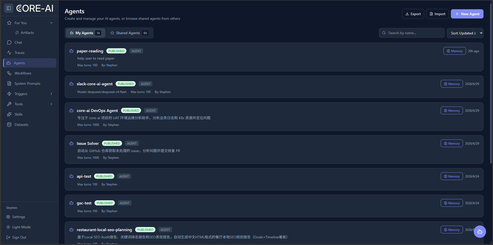
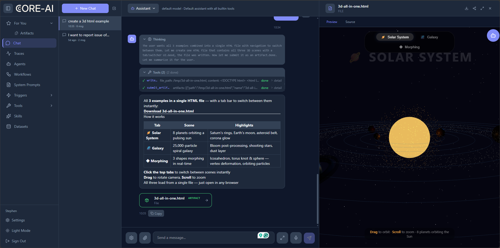

# Core AI Server

Server manages Agent definitions, tools, skills and datasets, with Web, REST and SSE entry points. It depends on MongoDB, Redis and the Java framework. Model providers and sandbox infrastructure are configured separately.

## Start with the guide

[English Server guide](/en/server) · [中文 Server 指南](/cn/server) · [Full operations manual (Chinese)](/cn/manual/#第一部分-core-ai-server)

The repository Compose file uses external volumes and enables Docker sandboxing. It requires configuration for your environment. Follow the guide before starting it; do not assume that cloning and `up -d` are sufficient.

## Agent and Chat

Create a draft, set an available model and minimal prompt, test in Chat, then publish according to permissions. Saving and publishing are separate actions. Traces help locate a failed step.

These are real repository screenshots from July 2026. Server and models were not accessed in this documentation task; UI labels may vary by version.

## API and configuration

[API navigation](/api/) · [Session REST/SSE (Chinese)](/cn/manual/#_6-使用会话-rest-与-sse) · [Configuration (Chinese)](/cn/manual/#_3-配置项与源码启动) · [Server source README](https://github.com/chancetop-com/core-ai/blob/master/core-ai-server/README.md)

SSE uses PUT and `agent-session-id`. Actual availability depends on the deployed version, account, enabled models and permissions. Refer to DTOs and handlers for request contracts.
