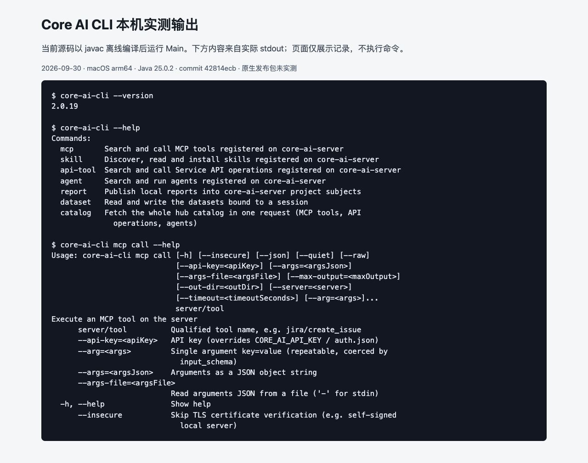

# CLI Guide

`core-ai-cli` provides local agents, editor ACP and Server Hub commands. It can use a provider directly or sign in to Server for its proxy and authorized resources.

## Install and verify {#安装与确认}

Choose an OS and architecture supported by the [official release](https://github.com/chancetop-com/core-ai/releases). Assets are `core-ai-cli-darwin.tar.gz` and `core-ai-cli-windows.zip`; executables are `core-ai-cli-darwin` and `core-ai-cli-windows.exe`. Copy to a user bin and add it to user PATH.

- [macOS steps (Chinese)](/cn/manual/#_10-macos-安装与检查): extract, inspect architecture, executable bit and shell PATH.
- [Windows steps (Chinese)](/cn/manual/#_11-windows-安装与检查): PowerShell extraction, exe name, user PATH and spaces.
- [Troubleshooting](cli-troubleshooting.md): old executables, quoting, encoding and hooks.

Native releases include a runtime. Source builds require Java 25. Native installation and Windows execution were not verified.

```sh
core-ai-cli --version
core-ai-cli --help
core-ai-cli mcp call --help
```

Expect the selected version and command parameters. The screenshot shows the initial 2.0.19 source JVM output; all eight 2.0.21 help/version checks also passed. It is a browser presentation of real stdout, not a native-release run.



## Connect Server {#连接-server}

Replace the placeholder with your own test service:

```sh
core-ai-cli --login=https://core-ai.example.com
```

Complete login interactively. Credentials stay in user `~/.core-ai/auth.json`. First discover resources:

```sh
core-ai-cli catalog --json
core-ai-cli mcp search echo --json
```

Pass an actual search result to `mcp describe`, prepare an arguments file from the schema, then call it with `--args-file args.json --json`. `demo/echo` is an offline fixture name and may not exist on the service. These network operations were source-checked, not executed.

The root command has no `--server`; Hub subcommands still support it. Consult each command's help and keep real keys out of screenshots or shared histories.

## Independent providers and workspace {#独立模型与工作区}

Model settings are in `~/.core-ai/agent.properties`; workspace `.core-ai/agent.properties` can override them. [Provider setup (Chinese)](/cn/manual/#_13-登录-server-或独立配置模型) lists actual properties and activation rules.

```sh
core-ai-cli --workspace /path/to/my-project
core-ai-cli --continue
core-ai-cli --resume
```

These Agent commands can call a model. Configure a test provider first. Use `/help` in the interactive session; `/init` creates `.core-ai/AGENTS.md`. [Paths and precedence (Chinese)](/cn/manual/#_15-配置和资源路径) describes loading order.

## Further operations {#更多操作}

[Hub discovery (Chinese)](/cn/manual/#_16-hub-先搜索再描述再调用) · [Agents / skills / reports (Chinese)](/cn/manual/#_17-agent-skill-api-与报告) · [Datasets and exit codes (Chinese)](/cn/manual/#_18-会话数据集与退出码)
